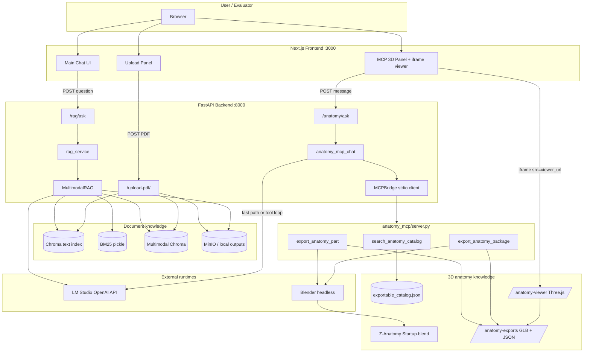
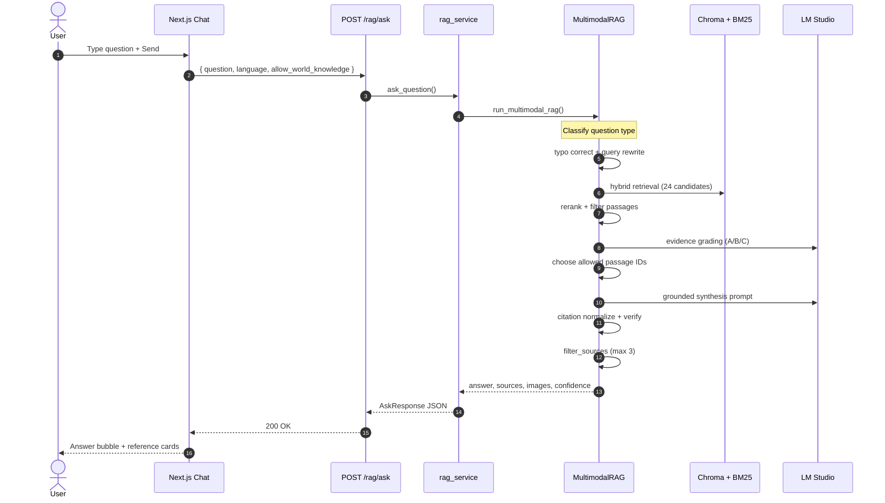
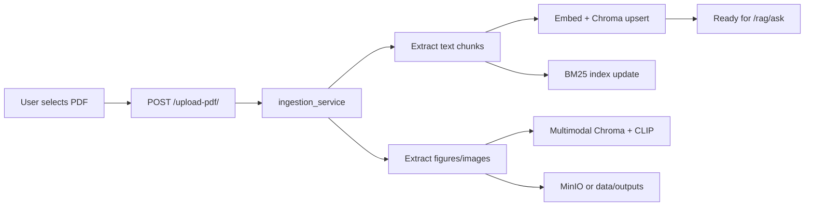
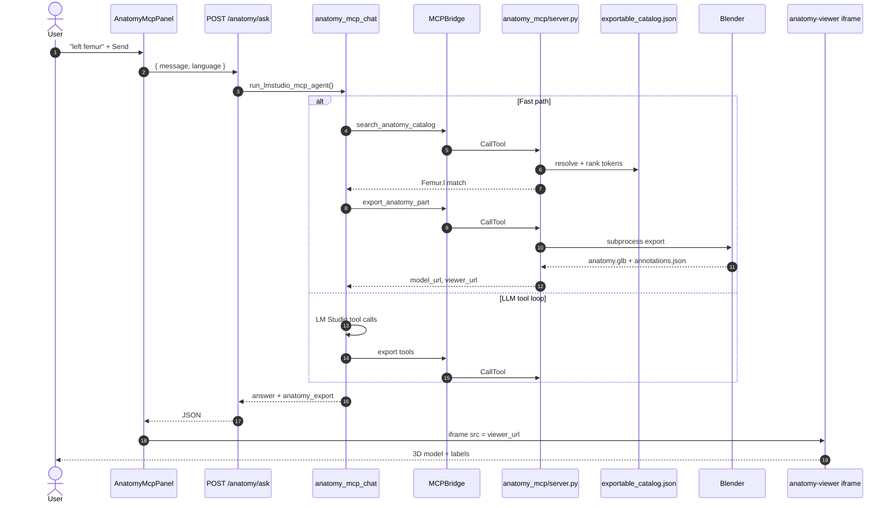
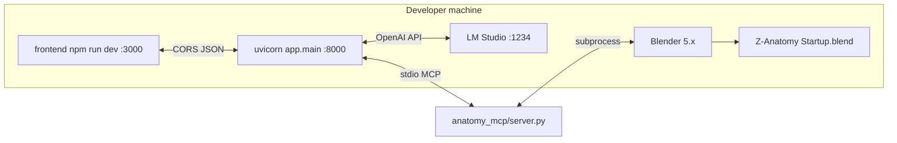

# HFU Anatomy Chatbot — Architecture Pack for Diagram Generation

Use this document as-is in ChatGPT (or any diagram tool). It describes your **two separate systems**, components, data stores, API contracts, and **two end-to-end test walkthroughs**.

---

## 1. Executive summary

The application has **two independent modes** that share only the FastAPI backend and optional LM Studio:

| Mode | UI location | Primary input | Primary output | Grounding source |
|------|-------------|---------------|----------------|------------------|
| **RAG Chatbot** | Main chat (center) | Natural-language question (+ optional PDF upload) | Grounded text answer + up to 3 references + optional images | Uploaded PDFs indexed in Chroma/BM25 |
| **MCP 3D Anatomy** | Right sidebar panel | Structure name (e.g. `left femur`, `Femur.l`) | GLB + annotations JSON + embedded Three.js viewer | Z-Anatomy `Startup.blend` via Blender export |

They must **not** be mixed in evaluation: RAG answers from documents; MCP produces 3D assets from the anatomy catalog.

---

## 2. System context (high level)

### Components

| Layer | Technology | Role |
|-------|------------|------|
| **Frontend** | Next.js (`frontend/`) | Chat UI, upload panel, MCP panel, i18n (EN/DE) |
| **API** | FastAPI (`app/main.py`) | REST routes, CORS, static file mounts |
| **RAG engine** | `src/multimodal/multimodal_rag_chain.py` | Retrieve → grade evidence → synthesize answer |
| **LLM (RAG)** | LM Studio / OpenAI-compatible (`src/llm/`) | Grounded synthesis, evidence classifier |
| **Indexes** | Chroma + BM25 (`data/processed/`) | Text chunks from PDFs |
| **Multimodal index** | Chroma multimodal + CLIP | Figure/image retrieval |
| **Storage** | MinIO (optional) or local `data/outputs/` | PDFs, extracted images |
| **MCP host** | `app/services/anatomy_mcp_chat.py` | Tool-calling orchestration |
| **MCP server** | `anatomy_mcp/server.py` (stdio) | Catalog search, Blender export |
| **Catalog** | `exportable_catalog.json` | Geometry-proven labels from Z-Anatomy |
| **Blender** | 5.x headless | Export GLB + annotations |
| **3D viewer** | `anatomy_mcp/viewer/` (Three.js) | iframe in MCP panel |

### Static mounts (backend)

- `/outputs/` — published RAG images
- `/anatomy-exports/` — GLB, packages, annotations
- `/anatomy-viewer/` — viewer HTML/JS

### Key API endpoints

| Endpoint | Method | Mode |
|----------|--------|------|
| `/rag/ask` | POST | RAG chat |
| `/upload-pdf/` | POST | Ingest PDF into indexes |
| `/anatomy/ask` | POST | MCP 3D (main panel flow) |
| `/anatomy/health` | GET | MCP readiness check |
| `/anatomy/search` | GET | Catalog search (LLM-mediated) |
| `/anatomy/export` | POST | Direct export request |

### External dependencies

- **LM Studio** at `http://127.0.0.1:1234/v1` — required for MCP agent; also used by RAG LLM
- **Blender** — path in `.env` / `BLENDER_EXE`
- **Z-Anatomy** — `Startup.blend` (path in `.env`)

---

## 3. Master architecture diagram (for ChatGPT)

**Prompt to ChatGPT:**

> Draw a professional system architecture diagram from the following Mermaid. Use two color groups: blue for RAG/document path, green for MCP/3D path. Include a user actor, Next.js frontend, FastAPI backend, data stores, LM Studio, Blender, and Z-Anatomy.



---

## 4. Mode A — RAG Chatbot architecture

### 4.1 Purpose

Answer questions **only from uploaded textbook/lab PDFs**, with strict grounding, max **3** reference cards (2-line previews), optional figure images.

### 4.2 Sequence diagram (RAG ask)



### 4.3 RAG pipeline stages (internal)

1. **Input validation** — language, off-topic check, world-knowledge consent gate
2. **Question classification** — simple / complex / quote / figure-linked
3. **Query processing** — typo correction, multi-query rewrite
4. **Retrieval** — hybrid BM25 + dense (Chroma); multimodal retriever for figures
5. **Evidence grading** — LLM labels passages A (direct), B (partial), C (weak)
6. **Synthesis** — only allowed passages in prompt; citation IDs `[1]`, `[2]`…
7. **Post-processing** — verify answer, attach ≤3 sources, rank ≤3 images
8. **Abstain** — if no usable evidence and no consent → “not found in provided documents”

### 4.4 Ingestion flow (upload PDF)



---

## 5. Mode B — MCP 3D Anatomy architecture

### 5.1 Purpose

Resolve a structure name against **exportable_catalog.json**, export geometry from **Z-Anatomy** via **Blender**, return URLs for GLB, annotations, and an embedded viewer.

### 5.2 MCP tools

| Tool | Function |
|------|----------|
| `search_anatomy_catalog` | Token/exact/resolved search in catalog |
| `export_anatomy_part` | Single-part GLB + annotations (cache-aware) |
| `export_anatomy_package` | Study package with subparts (large structures) |

### 5.3 Two execution paths

**Fast path** (plain queries like `left femur`, `Femur.l`):

1. `search_anatomy_catalog`
2. `best_catalog_export_match` → e.g. `Femur.l`
3. `export_anatomy_part` (Blender, serialized lock)
4. Return `anatomy_export` with `model_url`, `viewer_url` — **no fake LLM “Exported” without URLs**

**LLM tool loop** (complex phrasing):

1. LM Studio receives OpenAI-style tool schemas
2. Up to 6 rounds: model chooses tools → backend `call_tool` via stdio
3. On success: `build_success_answer` + `anatomy_export`
4. On failure: explicit `export_failed: blender_export_failed` (not empty viewer)

### 5.4 Sequence diagram (MCP ask)



### 5.5 Catalog resolution logic (conceptual)

```
User text: "left femur"
    → catalog_query: "left femur"
    → normalized: "left_femur"
    → lateral rules: left_femur | femur_l
    → catalog match: Femur.l (object, side=left)
    → Blender exports mesh + annotation anchors
```

---

## 6. Deployment / runtime topology



**Startup checklist**

1. LM Studio running with tool-capable model
2. Backend: `.venv311\Scripts\python.exe -m uvicorn app.main:app --host 127.0.0.1 --port 8000`
3. Frontend: `npm run dev` in `frontend/`
4. `GET /anatomy/health` → `ready: true`

---

## 7. Example 1 — Test the RAG chatbot (full I/O lifecycle)

### Scenario

You uploaded a cardiovascular anatomy PDF and ask a **document-grounded** question.

### Preconditions

- At least one PDF indexed via **Knowledge Base → Upload**
- `data/processed/chroma/` and `bm25_index.pkl` exist
- LM Studio running (for synthesis)

### Step-by-step I/O

| Step | Actor | Action | Request | Response / UI |
|------|-------|--------|---------|----------------|
| 1 | User | Upload `heart_valves_chapter.pdf` | `POST /upload-pdf/` multipart `file` | `{ status, message, pipeline: [...] }` — chunks indexed |
| 2 | User | Ask in main chat | — | Question visible in thread |
| 3 | Frontend | Send question | `POST http://127.0.0.1:8000/rag/ask`<br>`{ "question": "What is the function of the mitral valve?", "allow_world_knowledge": false, "language": "en" }` | — |
| 4 | Backend | Retrieve | Internal: hybrid search → ~24 candidates → rerank → top passages | Passages from uploaded PDF pages |
| 5 | Backend | Grade + synthesize | LLM grades evidence A/B/C; builds prompt with allowed passages only | Draft answer with `[1]`, `[2]` citations |
| 6 | Backend | Attach sources | `filter_sources_post_generation(max_sources=3)` | ≤3 `SourceItem` objects |
| 7 | API | Return | — | Example shape below |
| 8 | UI | Render | `ChatMessage.js` | Answer text + up to 3 reference cards (source, page, 2-line preview) |

### Example request (copy for Postman/curl)

```http
POST /rag/ask HTTP/1.1
Host: 127.0.0.1:8000
Content-Type: application/json

{
  "question": "What is the function of the mitral valve?",
  "allow_world_knowledge": false,
  "force_quote_mode": false,
  "language": "en"
}
```

### Example response (illustrative)

```json
{
  "answer": "The mitral valve prevents backflow of blood from the left ventricle into the left atrium during ventricular systole [1]. It opens during diastole to allow atrial filling of the ventricle [2].",
  "sources": [
    {
      "source": "heart_valves_chapter.pdf",
      "page": 42,
      "chunk_preview": "The mitral (bicuspid) valve lies between the left atrium and left ventricle...",
      "support_score": 0.91
    },
    {
      "source": "heart_valves_chapter.pdf",
      "page": 43,
      "chunk_preview": "During diastole the mitral valve opens, permitting blood to flow into the ventricle...",
      "support_score": 0.84
    }
  ],
  "images": [],
  "local_content_found": true,
  "world_knowledge_used": false,
  "requires_world_knowledge_consent": false,
  "question_type": "simple",
  "confidence": {
    "overall": 0.82,
    "corpus_fit": true
  },
  "grounding": {
    "primary_basis": "retrieved_corpus_synthesized",
    "had_retrieved_passages_in_prompt": true,
    "unique_text_passages_used": 2
  }
}
```

### What to verify (RAG pass/fail)

| Check | Pass |
|-------|------|
| Answer cites only uploaded material | Yes, with `[1]`/`[2]` matching sources |
| References panel shows ≤3 items | Yes |
| No 3D viewer / GLB URLs in RAG mode | None in response |
| If PDF has no mitral content | Abstain or “not found in provided documents” — **not** a fabricated citation |

### Negative test (same mode)

```json
{ "question": "What is the capital of France?", "allow_world_knowledge": false, "language": "en" }
```

Expected: consent prompt or abstain — **not** a anatomy/textbook answer unless user consents to world knowledge.

---

## 8. Example 2 — Test the MCP 3D tool (full I/O lifecycle)

### Scenario

User requests **left femur** in the MCP sidebar (not the main RAG chat).

### Preconditions

- `GET /anatomy/health` → `blender_exists: true`, `exportable_catalog_exists: true`, `mcp_stdio_ok: true`
- Z-Anatomy blend path valid in `.env`

### Step-by-step I/O

| Step | Actor | Action | Request | Response / UI |
|------|-------|--------|---------|----------------|
| 1 | User | Type in MCP panel | — | `left femur` |
| 2 | Frontend | Call MCP API | `POST /anatomy/ask`<br>`{ "message": "left femur", "language": "en" }` | — |
| 3 | Backend | Fast path search | MCP tool `search_anatomy_catalog(query="left femur")` | `results`: `Femur.l`, match_reason `resolved_query` / `token_overlap` |
| 4 | Backend | Export | MCP tool `export_anatomy_part(part_query="Femur.l")` | Blender writes package/GLB under `anatomy_mcp/exports/` |
| 5 | Backend | Map URLs | `structured_to_anatomy_export` | `model_url`, `annotations_url`, `viewer_url` |
| 6 | API | Return | — | Example JSON below |
| 7 | UI | `AnatomyMcpPanel` | `exportData.status === "ok"` | Export panel: Viewer / GLB / Annotations links |
| 8 | UI | iframe | `src = viewer_url` | Three.js loads GLB + annotation JSON |

### Example request

```http
POST /anatomy/ask HTTP/1.1
Host: 127.0.0.1:8000
Content-Type: application/json

{
  "message": "left femur",
  "language": "en"
}
```

### Example success response (illustrative)

```json
{
  "answer": "Exported Femur.l via search_anatomy_catalog → export_anatomy_part.",
  "anatomy_export": {
    "status": "ok",
    "part_query": "left femur",
    "part_label": "Femur.l",
    "model_url": "http://127.0.0.1:8000/anatomy-exports/packages/femur_l_abc123/anatomy.glb",
    "annotations_url": "http://127.0.0.1:8000/anatomy-exports/packages/femur_l_abc123/annotations.json",
    "viewer_url": "http://127.0.0.1:8000/anatomy-viewer/index.html?model=...&annotations=...",
    "source_blend": "Startup.blend",
    "annotation_count": 646,
    "selected_objects": ["Femur.l", "Vastus lateralis muscle.ol", "..."]
  },
  "mcp_tools_used": ["search_anatomy_catalog", "export_anatomy_part"],
  "mcp_mode": "lmstudio_mcp",
  "catalog_info": {
    "catalog_name": "exportable_catalog.json",
    "source_blend": "Startup.blend"
  }
}
```

### Example failure response (what you saw before fixes)

```json
{
  "answer": "Found left femur in exportable_catalog.json but export failed: blender_export_failed.",
  "anatomy_export": {
    "status": "error",
    "part_query": "left femur",
    "error": "blender_export_failed"
  },
  "mcp_tools_used": ["search_anatomy_catalog", "export_anatomy_part", "export_anatomy_package"]
}
```

UI: error message in panel — **no empty iframe pretending success**.

### What to verify (MCP pass/fail)

| Check | Pass |
|-------|------|
| `anatomy_export.status` | `"ok"` |
| `model_url` returns GLB (HTTP 200) | File size > 0 |
| iframe viewer shows bone mesh | Visible 3D model |
| `mcp_tools_used` includes export tool | Not search-only |
| Catalog label for exact bone only | Use `Femur.l` (smaller mesh than `left femur` package with muscles) |

### Health check (before MCP test)

```http
GET /anatomy/health
```

Expect: `"ready": true`, `"mcp_stdio_ok": true`, `"blender_exists": true`.

---

## 9. Side-by-side comparison (for thesis text)

| Dimension | RAG Chatbot | MCP 3D Anatomy |
|-----------|-------------|----------------|
| **UI** | Center chat | Right `AnatomyMcpPanel` |
| **Endpoint** | `POST /rag/ask` | `POST /anatomy/ask` |
| **Knowledge** | User PDFs | Z-Anatomy catalog + blend file |
| **Retrieval** | Chroma + BM25 + optional CLIP images | Catalog token/label resolver |
| **Generation** | LLM synthesis from passages | Blender mesh export (LLM orchestrates tools) |
| **Primary output** | Text + ≤3 references | GLB + annotations + viewer URL |
| **Typical latency** | 5–30 s | 30–120 s (Blender) |
| **Example input** | “What is the function of the mitral valve?” | `left femur` or `Femur.l` |
| **Must not happen** | Invent citations | “Exported” without `model_url` |

---

## 10. ChatGPT prompts to generate polished diagrams

### Prompt A — System context

```
Create a clean system architecture diagram for a thesis figure titled
"HFU Multimodal Anatomy Chatbot — System Context".

Include:
- User browser
- Next.js frontend on port 3000 with two panels: Main Chat (RAG) and MCP 3D Sidebar
- FastAPI backend on port 8000
- Two parallel pipelines: Document RAG (blue) and MCP 3D (green)
- Data stores: Chroma, BM25, MinIO, exportable_catalog.json, anatomy-exports
- External: LM Studio, Blender, Z-Anatomy Startup.blend
- Show that RAG does NOT use Blender and MCP does NOT use PDF indexes

Style: academic, white background, labeled arrows, legend for colors.
Use the Mermaid flowchart in Section 3 as the source of truth.
```

### Prompt B — RAG sequence

```
Draw a UML sequence diagram for the RAG chatbot path only:
User → Next.js → POST /rag/ask → MultimodalRAG → Chroma/BM25 → LM Studio → response with sources.

Number the steps 1-8. Add a note box for "max 3 reference cards".
Use the Mermaid in Section 4.2 as the source of truth.
```

### Prompt C — MCP sequence

```
Draw a UML sequence diagram for the MCP 3D anatomy path:
User → AnatomyMcpPanel → POST /anatomy/ask → fast path → MCP tools → Blender → GLB → iframe viewer.

Show both success path and failure path (export_failed, no iframe).
Use the Mermaid in Section 5.4 as the source of truth.
```

### Prompt D — Combined swimlane (evaluation slide)

```
Create a swimlane diagram with lanes: User, Frontend, FastAPI, RAG Engine, MCP Server, Blender, LM Studio.

Lane 1 example: mitral valve question through RAG.
Lane 2 example: left femur through MCP.
Highlight different inputs and outputs at the end of each swimlane.
```

---

## 11. One-page data-flow summary (paste into thesis)

```
┌─────────────────────────────────────────────────────────────────────────┐
│                         USER (Browser :3000)                             │
├──────────────────────────────┬──────────────────────────────────────────┤
│   MAIN CHAT (RAG)            │   MCP PANEL (3D)                          │
│   • Upload PDF               │   • Type structure name                   │
│   • Ask textbook question    │   • View iframe + download GLB          │
└──────────────┬───────────────┴──────────────────┬───────────────────────┘
               │ POST /rag/ask                     │ POST /anatomy/ask
               ▼                                   ▼
┌──────────────────────────┐         ┌──────────────────────────┐
│ MultimodalRAG            │         │ anatomy_mcp_chat         │
│ retrieve → grade → LLM   │         │ fast path OR LM tools    │
└──────────┬───────────────┘         └──────────┬───────────────┘
           │                                    │ stdio MCP
           ▼                                    ▼
┌──────────────────────────┐         ┌──────────────────────────┐
│ Chroma + BM25 + images   │         │ catalog + Blender export │
└──────────┬───────────────┘         └──────────┬───────────────┘
           │                                    │
           ▼                                    ▼
     Text answer +                      GLB + annotations +
     ≤3 PDF references                   viewer_url (Three.js)
```

---

## 12. Quick test commands

**RAG**

```powershell
curl -X POST http://127.0.0.1:8000/rag/ask -H "Content-Type: application/json" -d "{\"question\":\"What is the function of the mitral valve?\",\"allow_world_knowledge\":false,\"language\":\"en\"}"
```

**MCP**

```powershell
curl -X POST http://127.0.0.1:8000/anatomy/ask -H "Content-Type: application/json" -d "{\"message\":\"left femur\",\"language\":\"en\"}"
```
