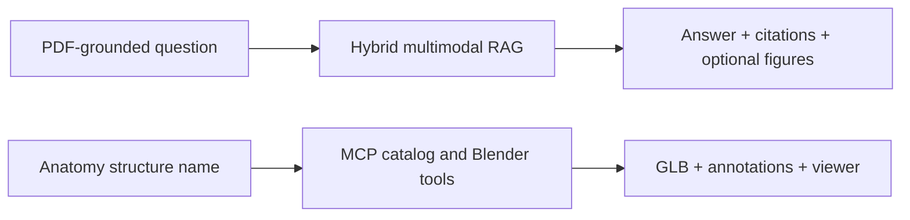
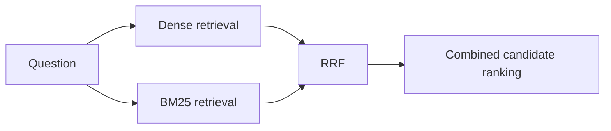
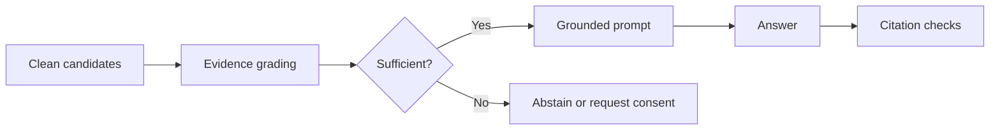
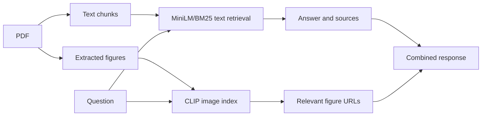
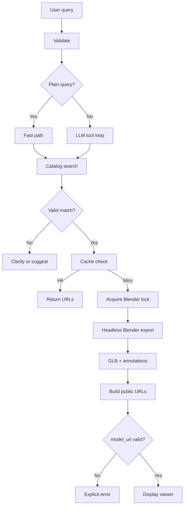

# Thesis Complete Chat, Learning Guide, Chapter Plan, and GPT Prompt Pack

**Project:** Multimodal Anatomy Learning Assistant  
**Working title:** *Design and Implementation of a Multimodal Anatomy Learning Assistant Using Retrieval-Augmented Generation and Model Context Protocol-Based 3D Visualization*  
**Purpose:** A single project source that consolidates the substantive content of the complete thesis-planning and teaching conversation, the system-evolution narrative, the 13 technical learning chapters, the final thesis structure, evidence requirements, a scientific-reference backbone, and copy-ready prompts for drafting each thesis chapter.

> **Compilation note:** This is a content-complete, reorganized compilation of the user–assistant discussion rather than a word-for-word transcript. Repeated explanations have been merged so that the file is practical as a project source. The chronological conversation index below preserves the full sequence of topics discussed.

---

## How to use this file

Use this document for five purposes:

1. **Learn the technical system:** Read Part II, Learning Chapters 1–13.
2. **Understand the research story:** Read Part I and Chapter 4 of the thesis plan.
3. **Draft the thesis:** Use Part III and the prompts in Part IV.
4. **Build the bibliography:** Start from Part V and verify every entry in a reference manager.
5. **Prepare the defence:** Use Part VII.

This file is not itself evidence that an implementation works. Implementation claims must be checked against the frozen repository; numerical claims must come from saved evaluation runs; scientific claims must cite verified literature.

---

## Source hierarchy for the thesis

Use sources in this order:

1. **Frozen repository commit and source code** for implementation facts.
2. **Raw final evaluation data** for numerical results.
3. **Uploaded project documents** for architecture history and supervisor requirements.
4. **Peer-reviewed scientific literature** for theory and prior evidence.
5. **Official technical specifications and documentation** for MCP, Blender, Chroma, Three.js, FastAPI, and Z-Anatomy.
6. **This consolidated guide** as a planning and navigation source, not as a substitute for primary evidence.

Key project files:

- `PROJECT_SUMMARY.md`
- `ARCHITECTURE_FOR_DIAGRAMS.md`
- `THESIS_SYSTEM_DESIGN_AND_MCP.md`
- `THESIS_RESEARCH_LOG.docx`
- `EVALUATION_DATA_SUMMARY.md`
- `PROFESSOR_REQUIREMENTS_TRACEABILITY.md`
- `CHAPTER_CHAT_PROMPTS.md`
- `THESIS_MASTER_RESOURCE.md`
- `ThesisBackend-main.zip`
- `thesis_chapter_planning_tracker.xlsx`

---

## Chronological conversation index

The discussion progressed in the following order:

1. Explain how the thesis started, evolved, and what is happening now.
2. Design a plan for understanding the complete thesis.
3. Teach Lesson 1: normal LLM to grounded RAG.
4. Teach Lesson 2: how PDFs become searchable knowledge.
5. List the intended learning chapters.
6. Compress the curriculum into a realistic five-day plan.
7. Teach Chapter 3: embeddings, similarity, and Chroma.
8. Teach Chapter 4: BM25, hybrid retrieval, and RRF.
9. Teach Chapter 5: query processing, reranking, and deduplication.
10. Teach Chapter 6: evidence grading, grounding, citations, and abstention.
11. Teach Chapter 7: CLIP and multimodal RAG.
12. Teach Chapter 8: complete RAG workflow and evaluation.
13. Teach Chapter 9: Blender, GLB, and Z-Anatomy foundations.
14. Teach Chapter 10: evolution of the 3D approach.
15. Teach Chapter 11: MCP fundamentals.
16. Teach Chapter 12: complete MCP export workflow.
17. Teach Chapter 13: MCP evaluation, dual-pipeline architecture, and defence.
18. Design the final thesis structure, page budget, scientific-reference strategy, and chapter-writing prompts.

Every topic above is represented in this document.

---

# Part I — The thesis story from the beginning to the final architecture

## 1. Original motivation

The project began as an anatomy question-answering chatbot over uploaded educational PDFs. The intended benefit was not simply conversational interaction; the system needed to answer from local course material and make the evidence inspectable.

The initial problem had four dimensions:

- General LLMs can produce plausible but unsupported anatomy statements.
- An uploaded PDF is not automatically part of an LLM's parametric knowledge.
- Text-only question answering does not cover figures and spatial anatomy well.
- A conversational statement such as “I generated a 3D femur” does not prove that a model exists.

The project therefore evolved into a **multimodal anatomy learning assistant** with two separate responsibilities:

- **Mode A — Document RAG:** uploaded PDFs → grounded answer, up to three references, optional figures.
- **Mode B — MCP 3D Anatomy:** Z-Anatomy and Blender → GLB, annotation JSON, viewer URL.

## 2. Initial dense-only RAG baseline

The first reasonable baseline was:

```text
PDF upload
→ text extraction
→ chunking
→ MiniLM embeddings
→ Chroma
→ dense top-k retrieval
→ LLM prompt
→ answer
```

Why it was selected:

- It was the fastest path to an end-to-end prototype.
- It required no LLM fine-tuning.
- It demonstrated that local documents could be indexed and retrieved.
- It created a baseline against which later improvements could be evaluated.

Observed shortcomings:

- Exact anatomy terms were sometimes missed.
- Related but insufficient passages were retrieved.
- Duplicate chunks produced citation sprawl.
- Weak retrieval allowed unsupported synthesis.
- Text-only retrieval could not handle figure questions.

## 3. Ingestion became a research concern

The project learned that RAG quality begins before retrieval. The PDF pipeline had to manage:

- text extraction and page order;
- page filtering;
- chunk size and overlap;
- source and page metadata;
- duplicate ingestion;
- image extraction;
- object-storage URLs;
- index reloading.

Key lesson:

> A retriever cannot recover evidence that was never extracted, was split badly, was removed incorrectly, or was never indexed.

## 4. Dense-only retrieval moved to hybrid retrieval

Dense retrieval was retained because it handles paraphrases and semantic similarity. BM25 was added because anatomy often depends on exact terms such as laterality, abbreviations, Latin names, and small lexical distinctions. Reciprocal Rank Fusion combined the ranked lists without directly averaging incompatible scores.

```text
Dense retrieval: “Does this passage mean something similar?”
BM25:            “Does it contain the important exact terms?”
RRF:             “How highly did both systems rank it?”
```

## 5. Raw candidates became controlled evidence

Hybrid retrieval still produced noisy results. The system therefore added:

- input validation and normalization;
- typo correction and query rewriting;
- broader initial candidate retrieval;
- reranking;
- text and source/page deduplication;
- a maximum of three unique final passages.

The three-source limit was introduced for inspectability and reduced citation clutter. It must not be described as a universal mathematical optimum.

## 6. Retrieval moved to grounding controls

A passage can mention a structure without answering the question. Evidence grading therefore distinguished direct, partial, and weak support. Approved passages were placed into a constrained prompt, followed by citation normalization and abstention when evidence was insufficient.

```text
Retrieval finds possible evidence.
Evidence grading determines whether it is sufficient.
Grounding constrains generation.
Citations expose provenance.
Abstention prevents unsupported answers.
```

## 7. Text-only RAG moved to multimodal RAG

Anatomy learning includes diagrams, radiology, histology, and spatial relationships. The project added:

- PDF image extraction;
- image metadata and captions;
- CLIP image embeddings;
- a separate multimodal Chroma store;
- image reranking and deduplication;
- local, MinIO, or Supabase URLs;
- late fusion of text and image results.

MiniLM and CLIP indexes remain separate because they represent different vector spaces.

## 8. Initial 3D experiments exposed a different problem

The first Blender path generated procedural geometry. It demonstrated subprocess execution and GLB production, but synthetic geometry was not sufficiently anatomy-grounded.

A remote render worker then provided fixed PNG previews. It was useful as a visual adjunct but could not export arbitrary structures or provide interactive geometry.

The project therefore moved to Z-Anatomy as the source of existing anatomy meshes.

## 9. Raw label search moved to geometry validation

A scene-name index proved only that a label existed, not that it contained valid mesh geometry. Broad matches could be empty, ambiguous, or excessively large.

The correction was `exportable_catalog.json`, containing geometry-validated entries suitable for export.

Key lesson:

> Search indexes for actions should represent executable capability, not merely available names.

## 10. Direct calls moved to proper MCP

Direct Python calls were useful during prototyping but did not provide a standard tool-discovery and execution contract. The final design introduced:

- a FastMCP server;
- stdio transport;
- MCP tool discovery;
- `ClientSession.call_tool`;
- structured outputs;
- an audit trail;
- a deterministic fast path and an LLM tool loop.

## 11. Natural-language success moved to artifact verification

The system now treats a 3D operation as successful only when a real export tool was called and a valid model artifact is returned.

```text
Verified success
=
export tool called
+ structured status == ok
+ model_url exists
+ GLB is accessible
+ viewer can load it
```

This prevents an LLM statement from being treated as proof that a model was generated.

## 12. Final contribution

The final contribution is a **dual-pipeline prototype**:



The two pipelines share the application shell but have separate:

- knowledge sources;
- processing methods;
- outputs;
- failure modes;
- evaluation metrics.

---
# Part II — Technical learning chapters 1–13

## Learning Chapter 1 — From a normal LLM to grounded RAG

### Core diagram

```text
Normal LLM:
Question → parametric model knowledge → generated answer

RAG:
Question → retrieve external evidence → add evidence to prompt
         → generate answer → expose supporting sources
```

### Essential concepts

- An LLM predicts tokens from context; fluent output is not proof of source fidelity.
- Parametric knowledge is represented indirectly in model weights.
- Uploading a PDF does not retrain the LLM.
- Hallucination includes incorrect, unsupported, or falsely attributed content.
- Grounding means that claims are supported by an identifiable source.
- Provenance includes the PDF, page, passage, and citation mapping.
- RAG has two broad phases: ingestion and query-time retrieval/generation.

### Why RAG was chosen

- It allows local documents to be added or removed without retraining.
- It provides inspectable passages and page metadata.
- It is suitable for copyright-sensitive educational corpora.
- It enables abstention when the corpus lacks evidence.

### What RAG does not automatically solve

- Retrieval can return the wrong passage.
- A related passage may be insufficient.
- The LLM can ignore or extend beyond the evidence.
- Citations can be attached incorrectly.
- The corpus itself can contain errors.

### Defence answer

> A normal LLM can provide plausible anatomy answers but cannot guarantee that they originate from the uploaded course material. RAG retrieves external evidence at query time and supplies it to the model, allowing the application to expose provenance and abstain when evidence is absent. It reduces but does not eliminate hallucination.

---

## Learning Chapter 2 — How PDFs become searchable knowledge

### Core diagram

```text
PDF
→ text extraction
→ page filtering
→ chunking and overlap
→ metadata
→ MiniLM embeddings
→ Chroma text index

PDF figures
→ extraction
→ caption/context metadata
→ object storage
→ CLIP embeddings
→ multimodal Chroma index
```

### Essential concepts

- Ingestion converts raw files into searchable records.
- PDF text extraction can fail because of scans, columns, tables, or vector graphics.
- Chunks must balance context and retrieval precision.
- Overlap protects information crossing chunk boundaries but creates duplication when excessive.
- Metadata enables source attribution and document management.
- Stable document and chunk IDs improve reproducibility and duplicate control.
- OCR is needed for bitmap-only pages and small figure labels.

### Project-specific concerns

- Reprocessing all PDFs can duplicate text vectors.
- Retrieval-time deduplication does not remove duplicate database entries.
- Page-level caption context can be noisy.
- Embedded-image extraction may miss vector figures or split composite diagrams.
- Persistent disk indexes and in-memory retrievers must be synchronized after ingestion.

### Defence answer

> The upload process stores the source PDF, extracts page text, filters obvious noise, splits retained content into overlapping chunks, attaches source and page metadata, embeds the chunks, and writes them to Chroma. Images are extracted separately, stored with captions and page context, embedded with CLIP, and indexed in a separate multimodal store. The active RAG component is then reloaded.

---

## Learning Chapter 3 — Embeddings, similarity, and Chroma

### Core diagram

```text
PDF chunk → MiniLM → document vector → Chroma
Question  → MiniLM → query vector    → nearest-neighbour search
```

### Essential concepts

- An embedding is a fixed-length vector representing useful semantic properties.
- Document chunks and queries must use the same compatible embedding model.
- Cosine similarity compares vector direction, not factual correctness.
- Similarity values are not calibrated probabilities.
- Dense retrieval is strong for paraphrases and conceptual similarity.
- It can blur exact distinctions such as left/right, nerve/artery, or similar Latin labels.

### What Chroma stores

- record ID;
- embedding;
- original chunk text;
- metadata such as source and page;
- persistent index data.

### What Chroma does not do

- It does not generate answers.
- It does not decide whether a passage is sufficient.
- It does not prove a source is correct.
- It does not verify citations.

### Defence answer

> MiniLM encodes PDF chunks and questions into the same semantic vector space. Chroma stores the document vectors with their text and metadata and returns the closest candidates for a query. Dense retrieval supports paraphrases, but similarity is not an answer-confidence value and does not reliably preserve every exact anatomical distinction.

---

## Learning Chapter 4 — BM25, hybrid retrieval, and RRF

### Core diagram



### BM25 intuition

BM25 rewards:

- occurrence of query terms;
- rare and discriminative terms;
- reasonable term frequency with saturation;
- document-length normalization.

It is useful for:

- exact anatomical names;
- laterality;
- abbreviations;
- numbers;
- Latin terminology;
- exact quotation tasks.

### Why hybrid retrieval was chosen

| Need | Dense retrieval | BM25 |
|---|---:|---:|
| Paraphrase | Strong | Often weaker |
| Exact term | Variable | Strong |
| Synonym | Strong | Weak without expansion |
| Laterality | Can blur | Stronger lexical control |
| Rare label | Variable | Strong |

### Why RRF was chosen

Dense and BM25 scores use different scales. RRF combines rank positions rather than raw scores:

\[
RRF(d)=\sum_r \frac{1}{k+rank_r(d)}
\]

RRF is transparent, does not require a trained fusion model, and preserves passages found strongly by either retriever.

### Defence answer

> Dense retrieval was retained for semantic matching, while BM25 was added for exact anatomy terminology. Because their raw scores are incompatible, Reciprocal Rank Fusion combines their result positions. This gives the system both semantic and lexical retrieval signals without requiring a separately trained fusion model.

---

## Learning Chapter 5 — Query processing, reranking, and deduplication

### Core diagram

```text
Raw question
→ validate and normalize
→ typo correction/query rewrite
→ broad hybrid retrieval
→ rerank
→ deduplicate
→ retain 0–3 unique passages
```

### Query processing

- validation rejects empty or unusable input;
- normalization standardizes case, whitespace, punctuation, and hyphens;
- typo correction helps BM25 but must avoid confusing valid anatomy pairs such as `ilium` and `ileum`;
- query rewriting bridges user language and textbook language;
- the original question remains the basis of final generation.

### Reranking

Retrieval asks which passages might be relevant. Reranking asks which candidates best answer the exact question. A structure-definition passage and a structure-function passage can both be relevant, but only one may be sufficient for a function question.

### Deduplication

Duplicates arise from:

- overlapping chunks;
- repeated ingestion;
- copied PDFs;
- dense and BM25 returning the same record;
- multiple similar chunks from one page.

Useful controls:

- normalized text fingerprint;
- source and page identity;
- canonical filename normalization;
- final unique-source cap.

### Why up to three passages

- improves inspectability;
- reduces prompt noise;
- lowers token use;
- avoids repeated source cards;
- keeps citations manageable.

It should be dynamic: zero when no evidence exists, one when one passage is sufficient, and two or three when evidence is complementary.

### Defence answer

> The raw question is normalized and may be rewritten to improve retrieval. A broad hybrid candidate pool is then reranked, after which near-duplicate text and repeated source pages are removed. The system retains up to three unique passages because evidence quality and diversity are more important than returning many similar chunks.

---

## Learning Chapter 6 — Evidence grading, grounding, citations, and abstention

### Core diagram



### Evidence grades

- **A — Direct:** clearly answers the question.
- **B — Partial:** useful but incomplete.
- **C — Weak:** topically related without answer support.

### Important distinctions

- relevance is not sufficiency;
- retrieval is not grounding;
- a citation marker is not citation correctness;
- grounding is not clinical correctness;
- process metadata is not an oracle of faithfulness.

### Citation dimensions

- **Correctness:** does the cited passage support the claim?
- **Completeness:** are all important claims cited?
- **Relevance:** is the source directly useful rather than merely related?

### Abstention and world knowledge

When evidence is insufficient, the system should:

- say the answer was not found;
- ask for clarification;
- request permission before using general knowledge;
- disclose when the answer is not document-grounded.

### Exact quotations

Quote mode requires an exact source span, preserved wording, source, and page. A paraphrase must not be presented as a quotation.

### Defence answer

> Hybrid retrieval returns candidates, but candidates are not automatically sufficient. Evidence grading filters direct, partial, and weak support before prompt construction. The LLM is constrained to approved passages, citations are checked against passage identifiers, and the system abstains when the corpus cannot support a reliable answer.

---

## Learning Chapter 7 — CLIP and multimodal RAG

### Core diagram



### Essential concepts

- CLIP uses a text encoder and image encoder aligned in a shared CLIP space.
- Text queries can retrieve visually related images.
- MiniLM and CLIP results are not directly comparable.
- The project uses late fusion: retrieve separately, combine in the API response.
- Captions and nearby text provide extra retrieval signals.
- Image URLs must be accessible through static serving or signed object-storage URLs.

### Why CLIP was chosen

- natural-language text-to-image search;
- no need to train a labelled custom anatomy dataset for the prototype;
- practical integration with a vector store;
- addresses figure blindness.

### Limitations

- small labels may be unreadable;
- CLIP is not anatomy-specialized;
- embedded-image extraction may miss complete figures;
- caption association can be noisy;
- visual similarity is not the same as educational usefulness.

### Defence answer

> The text-only system could not retrieve diagrams, so the ingestion pipeline extracts figures and stores CLIP image embeddings in a separate multimodal Chroma collection. The user question is encoded with the CLIP text encoder, relevant figures are filtered and deduplicated, and accessible image URLs are returned alongside the text answer through late fusion.

---

## Learning Chapter 8 — Complete RAG workflow and evaluation

### End-to-end workflow

```text
Upload PDF
→ extract text and figures
→ chunk text
→ MiniLM/Chroma + BM25
→ CLIP image index
→ process user question
→ dense + BM25 retrieval
→ RRF
→ rerank and deduplicate
→ evidence grading
→ grounded generation
→ citation normalization
→ optional image results
→ abstain when unsupported
```

### Evaluation levels

1. **Retrieval:** Precision@k, Recall@k, MRR, nDCG@k.
2. **Answer quality:** correctness, completeness, relevance, readability.
3. **Grounding:** faithfulness, citation correctness, citation completeness, hallucination rate.
4. **Boundary handling:** unsupported, off-topic, typo, exact quote, and consent cases.
5. **Operational performance:** latency, ingestion time, token use, URL availability, failure rate.

### Key ablations

- dense-only vs hybrid;
- without vs with query rewriting;
- without vs with deduplication;
- without vs with evidence grading;
- text-only vs text + CLIP;
- different candidate and final-source limits.

### Existing evaluation caution

Current spreadsheet results are useful as formative evidence but should not be labelled final unless reproduced on the frozen system with fixed models, prompts, corpus, and scoring rubric.

### Defence answer

> The complete RAG system must be evaluated at multiple levels because a correct-looking answer can hide a retrieval, grounding, or citation failure. Retrieval metrics test whether the evidence was found, answer metrics test the response, grounding metrics test claim support, and boundary tests evaluate safe refusal. Final claims must come from a frozen reproducible run.

---
## Learning Chapter 9 — Blender, GLB, and Z-Anatomy foundations

### Core diagram

```text
Anatomy query
→ resolve structure
→ launch Blender headlessly
→ open Z-Anatomy Startup.blend
→ select mesh objects
→ export GLB
→ create annotation JSON
→ load in Three.js
```

### Essential 3D concepts

- **Vertex:** a point in 3D space.
- **Edge:** a connection between vertices.
- **Face:** a polygonal surface.
- **Mesh:** connected vertices, edges, and faces representing a surface.
- **Object:** a Blender scene item containing mesh data and transforms.
- **Collection:** an organizational group of objects.
- **Transform:** location, rotation, and scale.
- **Material:** appearance information.

### Component responsibilities

- **Z-Anatomy:** source of existing anatomy geometry.
- **Blender:** loads, selects, validates, and exports geometry.
- **GLB:** compact browser-compatible 3D model file.
- **Annotation JSON:** labels and educational metadata.
- **Three.js:** browser viewer with camera, lighting, zoom, and rotation.

### Why this architecture was chosen

- Students should not need Blender.
- Backend exports must be automatable and reproducible.
- Geometry should come from a defined anatomy dataset rather than an LLM description.
- The browser needs a portable and inspectable model format.

### Defence answer

> Z-Anatomy is the source of named anatomical meshes. Blender runs in background mode to load the scene, select validated objects, and export a GLB. Annotation information is written separately, and Three.js displays the model in the browser. The LLM may interpret a request, but it does not create or verify the geometry itself.

---

## Learning Chapter 10 — Evolution of the 3D approach

### Evolution sequence

```text
Procedural Blender geometry
→ remote rendered previews
→ Z-Anatomy raw label index
→ geometry-validated catalog
→ direct Python calls
→ true MCP stdio tools
→ verified artifact-based success
```

### Stage-by-stage lessons

| Stage | Why tried | Main shortcoming | Correction |
|---|---|---|---|
| Procedural Blender | Fast demonstration | Synthetic, not anatomy-grounded | Use Z-Anatomy |
| Remote PNG preview | Easy visual enhancement | Fixed assets, no interactive arbitrary export | Separate MCP 3D mode |
| Raw scene-name index | Fast label search | Name did not prove mesh geometry | Exportable catalog |
| Direct Python calls | Quick integration | No standard tool contract | MCP client/server |
| Natural-language success | Conversational UX | Could claim success without a file | Require structured `model_url` |
| Parallel Blender | Higher throughput | Instability and file contention | Export lock |
| Fresh export each time | Simplicity | High repeated latency | Versioned cache |

### Central lesson

```text
Visual plausibility
< source traceability
< executable verification
```

A trustworthy 3D result requires validated source geometry, real tool execution, and an accessible artifact.

### Defence answer

> Procedural geometry demonstrated technical feasibility but not anatomical grounding. Z-Anatomy provided real source meshes, yet raw label search still produced empty or overly broad selections. A geometry-validated catalog corrected that problem. Direct calls were then replaced with MCP tools, and the application now verifies actual model URLs rather than trusting natural-language success messages.

---

## Learning Chapter 11 — MCP fundamentals

### Core architecture

```text
Browser
→ REST /anatomy/ask
→ FastAPI MCP host
→ MCP client bridge
→ stdio MCP server
→ catalog or Blender tool
→ structured result
→ verified frontend display
```

### Main roles

- **Host:** controls the user workflow, LLM, tool selection, and final verification.
- **Client:** maintains the protocol session, discovers tools, and calls them.
- **Server:** exposes limited, defined capabilities.
- **Tool:** a named operation with a description, input schema, and structured output.
- **Transport:** stdio carries JSON-RPC messages between the client and a child server process.

### Main tools

- `search_anatomy_catalog`
- `export_anatomy_part`
- `export_anatomy_package`

### Why MCP was chosen

- dynamic tool discovery;
- clear JSON schemas;
- process separation;
- structured results;
- tool-call auditability;
- compatibility with tool-capable hosts;
- safer capability boundaries than arbitrary code execution.

### Fast path vs LLM tool loop

- **Fast path:** simple label-like queries; avoids unnecessary LLM latency but still uses MCP.
- **LLM loop:** complex phrasing; the model selects tools, while the host executes and verifies them.

### What MCP does not guarantee

- anatomical correctness;
- correct catalog resolution;
- valid Blender geometry;
- a usable viewer.

It standardizes tool communication and makes actions inspectable.

### Defence answer

> MCP separates orchestration from tool execution. The FastAPI-side host uses a client session to discover and call tools on a separate FastMCP server over stdio. The server validates catalog queries, invokes Blender, and returns structured results. The protocol makes the action traceable, but correctness still depends on the catalog and export implementation.

---

## Learning Chapter 12 — Complete MCP export workflow

### Core workflow



### Workflow steps

1. Frontend calls `POST /anatomy/ask`.
2. Input is validated and normalized.
3. Host selects the fast path or LLM tool loop.
4. `search_anatomy_catalog` resolves a canonical entry.
5. Ambiguous queries produce clarification or suggestions.
6. Server selects part or package export.
7. Cache is checked.
8. On a miss, the server acquires the Blender lock.
9. Blender opens `Startup.blend`, selects validated geometry, and exports.
10. GLB, annotation JSON, and timing/metadata artifacts are written.
11. Local paths are mapped to public model, annotation, and viewer URLs.
12. Host rejects success if `model_url` is missing.
13. Frontend renders only `status == ok` results.

### Reliability mechanisms

- geometry-validated catalog;
- input schemas;
- one export at a time;
- versioned cache;
- structured errors;
- health endpoint;
- no empty viewer on failure;
- audit fields such as `mcp_tools_used`.

### Defence answer

> A simple request such as `left femur` is resolved to `Femur.l` through the catalog-search tool. The server checks the cache and, if necessary, serializes a headless Blender export from Z-Anatomy. It writes a GLB and annotations, constructs public URLs, and returns structured output. The host and frontend treat the request as successful only when a valid model URL is present.

---

## Learning Chapter 13 — MCP evaluation, dual architecture, and defence

### MCP evaluation levels

1. **Catalog resolution:** correct canonical label and laterality.
2. **Tool execution:** expected tools were discovered and called.
3. **Artifact generation:** non-empty, loadable GLB and valid JSON.
4. **Viewer:** model visible, centred, interactive, and correct.
5. **Performance:** cold vs cached latency.
6. **Safe failure:** invalid cases return explicit errors without a viewer.

### Suggested MCP metrics

\[
Catalog\ Match\ Accuracy=\frac{correct\ labels}{resolvable\ queries}
\]

\[
Export\ Success\ Rate=\frac{verified\ GLB\ exports}{valid\ requests}
\]

\[
Viewer\ Load\ Rate=\frac{correctly\ displayed\ models}{successful\ exports}
\]

\[
Unverifiable\ Success\ Rate=\frac{success\ claims\ without\ valid\ models}{all\ success\ claims}
\]

The desired unverifiable-success rate is zero.

### Suggested test categories

- exact labels;
- natural-language aliases;
- left/right pairs;
- ambiguous terms;
- vague terms;
- invalid/path-injection attempts;
- large packages;
- repeated cache requests;
- missing Blender, source file, catalog, or output artifact.

### Dual-pipeline rule

| Dimension | RAG | MCP 3D |
|---|---|---|
| Source | Uploaded PDFs | Z-Anatomy and catalog |
| Main operation | Retrieve and synthesize | Resolve and execute tool |
| Output | Answer, sources, figures | GLB, annotations, viewer |
| Main risk | Hallucination/citation failure | Wrong structure/fake success |
| Evaluation | Retrieval, grounding, citations | Resolution, artifacts, viewer |

### Central defence statement

> The system does not use one generative model to perform every task. It uses retrieval and provenance for document knowledge, and validated tool execution with observable artifacts for 3D geometry.

---
# Part III — Final thesis structure and page plan

## 1. Recommended title

**Design and Implementation of a Multimodal Anatomy Learning Assistant Using Retrieval-Augmented Generation and Model Context Protocol-Based 3D Visualization**

Alternative titles:

1. *A Multimodal RAG and MCP-Based Anatomy Chatbot for Grounded Question Answering and 3D Visualization*
2. *Building a Verifiable Anatomy Learning Assistant with Document-Grounded RAG and Blender-Based MCP Tooling*
3. *A Dual-Pipeline Architecture for Anatomy Education: Grounded PDF Question Answering and 3D Anatomy Export*

## 2. Recommended research framing

Frame the thesis as an **iterative design-science and software-engineering study**. The artifact is the anatomy learning assistant, and knowledge is produced through design, implementation, observation, correction, and evaluation.

```text
Problem identification
→ objectives and requirements
→ baseline artifact
→ demonstration
→ evaluation and observation
→ redesigned artifact
→ final evaluation
→ communication of lessons
```

This framing is defensible because the thesis is not merely a product report. It studies which design choices worked, which failed, why they failed, and what followed from the failures.

## 3. Recommended length

Target **approximately 90–100 pages of main text**, excluding front matter, bibliography, and appendices. A sensible working range is 85–105 pages, subject to the faculty's formal rules and supervisor agreement.

| Chapter | Range | Target |
|---|---:|---:|
| 1. Introduction | 6–8 | 7 |
| 2. Background and Related Work | 14–17 | 16 |
| 3. Research Methodology and Requirements | 8–10 | 9 |
| 4. System Evolution and Design Decisions | 14–17 | 16 |
| 5. Final System Design and Implementation | 15–18 | 17 |
| 6. Evaluation Methodology | 9–11 | 10 |
| 7. Results and Discussion | 13–16 | 14 |
| 8. Conclusion and Future Work | 4–6 | 5 |
| **Main text total** | **83–103** | **94** |

Likely additional material:

- front matter: 5–8 pages;
- bibliography: 6–10 pages;
- appendices: 15–35 pages;
- total submitted PDF: often around 115–145 pages.

Large code listings, full JSON responses, raw evaluations, environment logs, and secondary screenshots should go to appendices.

---

## Chapter 1 — Introduction

**Target:** 6–8 pages.

### What the chapter must establish

- Anatomy learning combines textual, visual, and spatial understanding.
- General-purpose LLM output is not sufficient when local source grounding is required.
- A claimed 3D action must be distinguished from a verifiable model artifact.
- The thesis addresses these problems through separate RAG and MCP pipelines.
- The system is an educational prototype, not clinical decision support.

### Recommended sections

#### 1.1 Motivation

Discuss anatomy's conceptual and spatial complexity, the use of local teaching material, and the potential of interactive systems.

#### 1.2 Problem statement

Define:

- hallucination and unsupported generation;
- lack of automatic access to uploaded PDFs;
- weak source traceability;
- text-only limitations;
- unverifiable 3D-generation claims.

#### 1.3 Research gap

Use cautious wording:

> RAG, multimodal retrieval, educational LLMs, and 3D anatomy have been studied individually. This thesis investigates their integration in a deliberately separated dual-pipeline prototype.

Do not state that no comparable system exists unless a systematic review supports the claim.

#### 1.4 Aim and objectives

1. Build document-grounded anatomy QA over uploaded PDFs.
2. Add optional figure retrieval.
3. Build a separate MCP-based 3D export path.
4. Evaluate RAG and 3D independently.
5. Document the design evolution and lessons learned.

#### 1.5 Research questions

- **RQ1:** How effectively can a hybrid RAG pipeline provide grounded anatomy answers from uploaded PDFs?
- **RQ2:** How does multimodal retrieval improve support for questions requiring figures or visual context?
- **RQ3:** How can MCP-based tool execution reduce unverifiable 3D-generation claims compared with prompt-only or direct-function approaches?
- **RQ4:** What trade-offs and limitations arise in a local-first multimodal anatomy learning assistant?

#### 1.6 Contributions

- dual-pipeline architecture;
- hybrid document retrieval;
- CLIP-based PDF-figure support;
- MCP-based Z-Anatomy export;
- geometry-validated catalog;
- independent evaluation protocols;
- documented engineering lessons.

#### 1.7 Scope and non-goals

State that the work is not:

- clinical diagnosis;
- medical decision support;
- a guarantee of anatomical correctness;
- a comprehensive test of all Z-Anatomy objects;
- a large student learning-outcome study, unless such a study is conducted.

#### 1.8 Thesis structure

Provide a short overview of Chapters 2–8.

### Suggested evidence

- supervisor requirements;
- final high-level architecture;
- one final UI screenshot showing both modes;
- literature on educational LLM opportunities/risks and 3D anatomy learning.

### Suggested figure

**Figure 1.1 — High-level dual-pipeline system context.**

### Core references

- Kasneci et al. (2023) for LLMs in education;
- Ji et al. (2023) for hallucination;
- Yammine and Violato (2015) and Moro et al. (2017) for 3D anatomy education.

---

## Chapter 2 — Background and Related Work

**Target:** 14–17 pages.

### What the chapter must establish

- The design decisions are grounded in established research.
- Retrieval and grounding address different problems.
- Sparse and dense retrieval have complementary strengths.
- CLIP supports image–text retrieval.
- RAG evaluation must cover retrieval and generation.
- 3D visualisation is educationally relevant but not automatically superior.
- Tool-using LLM research motivates external action execution.
- MCP is the implementation protocol used in the system.

### Recommended sections

#### 2.1 LLMs in education

Opportunities, adaptive explanation, risks, privacy, reliability, bias, and critical use.

#### 2.2 Hallucination, factuality, grounding, and provenance

Define the concepts and distinguish parametric from retrieved knowledge.

#### 2.3 Retrieval-Augmented Generation

Explain retrieval, non-parametric memory, generation, updateability, and provenance.

#### 2.4 Sentence embeddings and dense retrieval

Cover SBERT, MiniLM, dual encoders, vector similarity, and dense passage retrieval.

#### 2.5 Sparse and hybrid retrieval

Cover lexical matching, BM25, exact terminology, hybrid retrieval, and RRF.

#### 2.6 Multimodal retrieval and CLIP

Cover contrastive image–text alignment, shared embedding space, zero-shot retrieval, and limitations for specialised anatomy figures.

#### 2.7 Evaluation of RAG systems

Cover Precision@k, Recall@k, MRR, nDCG, answer correctness, faithfulness, citation correctness, hallucination, and RAGAS-style dimensions.

#### 2.8 3D anatomy visualisation

Review spatial learning, 3D visualisation, VR/AR evidence, limitations, and the role of browser-based models.

#### 2.9 Tool-using LLMs

Discuss external tools, action loops, ReAct, Toolformer, schemas, and structured outputs.

#### 2.10 Model Context Protocol

Explain host, client, server, tools, JSON-RPC, and stdio. Treat MCP as an official technical specification, not a learning algorithm.

#### 2.11 Positioning of this thesis

Use a related-work comparison table linking each field to the thesis contribution.

### Related-work table template

| Area | Representative work | Established contribution | Limitation/gap relevant here | Thesis response |
|---|---|---|---|---|
| Educational LLMs | Kasneci et al. | Opportunities and risks | No project-specific local grounding | PDF RAG |
| RAG | Lewis et al. | Retrieval + generation | Requires domain pipeline design | Hybrid anatomy RAG |
| Dense retrieval | Karpukhin et al. | Semantic passage retrieval | Exact terminology can remain difficult | BM25 + RRF |
| CLIP | Radford et al. | Text–image alignment | General-domain representation | PDF-figure retrieval |
| 3D anatomy | Yammine & Violato | Educational value of 3D | Not an on-demand export architecture | MCP viewer |
| Tool use | Yao et al.; Schick et al. | LLMs interacting with tools | General tool-use setting | MCP–Blender path |

### Anti-duplication rule

Chapter 2 explains what the methods are in the literature. It should not describe your implementation in detail.

---

## Chapter 3 — Research Methodology and Requirements

**Target:** 8–10 pages.

### What the chapter must establish

- The thesis follows a deliberate research process.
- Requirements came from educational aims, supervisor feedback, local constraints, and prototype observations.
- Evaluation maps to the research questions.
- The two pipelines require separate success criteria.

### Recommended sections

#### 3.1 Research approach

Introduce design-science research using Hevner et al., Peffers et al., and Wieringa.

#### 3.2 Research process used

Describe the actual cycles:

- dense baseline;
- formative evaluation;
- hybrid retrieval;
- grounding controls;
- multimodal expansion;
- procedural Blender experiments;
- Z-Anatomy and catalog;
- MCP redesign;
- frozen-system evaluation.

#### 3.3 Functional requirements

| ID | Requirement |
|---|---|
| FR1 | Upload and ingest PDFs |
| FR2 | Answer questions using indexed documents |
| FR3 | Return source and page references |
| FR4 | Retrieve optional figures |
| FR5 | Resolve anatomy structure names |
| FR6 | Export GLB and annotation JSON |
| FR7 | Display models in a web viewer |
| FR8 | Return explicit failure states |

#### 3.4 Non-functional requirements

- local-first operation;
- modularity;
- reproducibility;
- traceability;
- explainability;
- safe failure;
- restricted tool capability;
- manageable latency;
- copyright-sensitive storage.

#### 3.5 Constraints and assumptions

- Windows/Blender configuration;
- LM Studio dependency for complex requests;
- PDF extraction quality;
- limited OCR;
- available Z-Anatomy geometry;
- small evaluation datasets;
- no clinical deployment.

#### 3.6 Research-question traceability

| RQ | Artifact component | Experiment | Evidence |
|---|---|---|---|
| RQ1 | Hybrid RAG | Dense vs hybrid | Retrieval and grounding metrics |
| RQ2 | CLIP path | Text-only vs multimodal | Figure relevance |
| RQ3 | MCP tool path | Unverified vs verified action | Artifact and safe-failure tests |
| RQ4 | Whole prototype | Latency, setup, failures | Trade-off discussion |

#### 3.7 Evaluation separation

Explain why a combined RAG/MCP score would be uninterpretable.

### Suggested figures

- design-science cycle;
- requirements-to-RQ traceability diagram.

---

## Chapter 4 — System Evolution and Design Decisions

**Target:** 14–17 pages.  
**Role:** Core thesis chapter.

### What the chapter must establish

- The final architecture was not arbitrary.
- Each change followed an observed limitation.
- Failed approaches produced useful engineering knowledge.
- Alternatives were considered rather than ignored.

### Mandatory subsection pattern

For every design decision, write:

1. **Design tried**
2. **Rationale**
3. **Observation**
4. **Project evidence**
5. **Root cause**
6. **Alternatives considered**
7. **Selected correction**
8. **Outcome**
9. **Residual limitation**
10. **Lesson learned**

### Recommended sections

#### 4.1 Initial monolithic dense RAG

Why it was a sensible baseline and what it established.

#### 4.2 Dense-only to BM25 + dense + RRF

Shortcoming: exact terminology, laterality, abbreviations.  
Alternatives: different embedding model, cross-encoder, domain retraining, sparse retrieval.  
Decision: retain semantic retrieval and add BM25/RRF.

#### 4.3 Citation sprawl to deduplication and source limiting

Shortcoming: repeated pages and chunks.  
Correction: fingerprints, source/page identity, 0–3 final passages.

#### 4.4 Weak retrieval to evidence grading and abstention

Shortcoming: unsupported synthesis.  
Correction: evidence classes, constrained prompts, citation checks, consent gate.

#### 4.5 Text-only to CLIP figure retrieval

Shortcoming: figure blindness.  
Correction: extraction, CLIP, multimodal index, late fusion.

#### 4.6 Local paths to storage abstraction

Shortcoming: deployment-inaccessible assets.  
Correction: local mounts, MinIO, Supabase, signed URLs.

#### 4.7 Procedural Blender to Z-Anatomy

Shortcoming: synthetic geometry not tied to a defined anatomy dataset.

#### 4.8 Raw labels to geometry-validated catalog

Shortcoming: labels without valid mesh or overly broad collections.

#### 4.9 Direct Python calls to MCP stdio

Shortcoming: tight coupling, no standard discovery or audit trail.

#### 4.10 LLM success messages to model-url verification

Shortcoming: fluent claims without artifacts.

#### 4.11 Unsafe concurrency and repeated latency

Corrections: export lock and versioned cache.

#### 4.12 Mixed system to dual pipelines

Correction: separate panels, endpoints, knowledge sources, and metrics.

#### 4.13 Consolidated lessons

Use a design-decision matrix.

### Design-decision table template

| Iteration | Approach | Why selected | Observation | Root cause | Correction | Residual issue | Lesson |
|---|---|---|---|---|---|---|---|

### Evidence needed

- baseline/final architecture diagrams;
- weak-retrieval answer;
- duplicate-source example;
- abstention example;
- image retrieval example;
- procedural or failed Blender result;
- raw-label mismatch;
- MCP error JSON;
- valid viewer screenshot.

---

## Chapter 5 — Final System Design and Implementation

**Target:** 15–18 pages.

### What the chapter must establish

- The final implementation follows the design decisions.
- Each feature maps to code.
- RAG and MCP are operationally separate.
- Reliability and configuration are explicit.

### Anti-duplication rule

- Chapter 4: why the architecture changed.
- Chapter 5: how the final frozen system works.

### Recommended sections

#### 5.1 Final system context

User, Next.js, FastAPI, RAG engine, indexes, storage, MCP, Blender, Z-Anatomy, viewer.

#### 5.2 Repository structure

Brief folder and responsibility mapping.

#### 5.3 Frontend and API

Main chat, upload panel, source cards, images, MCP panel, iframe, loading/error states.

#### 5.4 PDF ingestion

Extraction, cleaning, chunking, metadata, embedding, Chroma, BM25, image processing, reloading.

#### 5.5 Text RAG pipeline

Question processing, dense/BM25 retrieval, RRF, reranking, deduplication, evidence grading, synthesis, citation filtering.

#### 5.6 Multimodal path

Image extraction, metadata, CLIP, multimodal Chroma, filtering, deduplication, URLs, late fusion.

#### 5.7 Storage

Local output, MinIO, Supabase, signed URLs, diagnostics.

#### 5.8 MCP host and client

Fast path, LLM loop, `list_tools`, `call_tool`, stdio, structured results, audit fields.

#### 5.9 MCP server and catalog

Search tool, part/package export, canonical labels, laterality, ambiguity, geometry validation.

#### 5.10 Blender and viewer

Headless process, `Startup.blend`, selection, GLB, annotations, static mounts, Three.js.

#### 5.11 Reliability

Locking, cache, health checks, timeouts, no viewer without `model_url`.

#### 5.12 Configuration and reproducibility

Record exact software, model, corpus, prompt, and hardware versions.

### Implementation mapping table

| Feature | Main file(s) |
|---|---|
| FastAPI entry | `app/main.py` |
| RAG service | `app/services/rag_service.py` |
| Ingestion orchestration | `app/services/ingestion_service.py` |
| Object storage | `app/services/object_storage.py` |
| Text ingestion | `src/ingestion/run.py` |
| Hybrid retrieval | `src/retrieval/hybrid_retriever.py` |
| RAG chain | `src/multimodal/multimodal_rag_chain.py` |
| Image retriever | `src/multimodal/multimodal_retriever.py` |
| MCP host | `app/services/anatomy_mcp_chat.py` |
| MCP client | `app/services/anatomy_mcp_client.py` |
| MCP server | `anatomy_mcp/server.py` |
| Export catalog | `anatomy_mcp/label_index/exportable_catalog.json` |
| MCP frontend | `frontend/app/components/AnatomyMcpPanel.js` |

### Suggested figures

- final architecture;
- RAG sequence;
- MCP sequence;
- deployment topology.

---

## Chapter 6 — Evaluation Methodology

**Target:** 9–11 pages.

### What the chapter must establish

- The protocol answers the research questions.
- Baselines and configurations are reproducible.
- Metrics are defined before results are shown.
- Exploratory and final evaluations are distinguished.

### Recommended sections

#### 6.1 Evaluation goals and RQ mapping

#### 6.2 Frozen evaluation environment

Record:

- commit hash;
- PDF hashes;
- embedding model and revision;
- RAG model/version;
- MCP model/version;
- prompts;
- chunk settings;
- retrieval settings;
- Chroma/BM25 versions;
- Blender version;
- Z-Anatomy source version;
- hardware and OS;
- date.

#### 6.3 RAG dataset

Question categories:

- simple fact;
- function;
- multi-part;
- exact term;
- paraphrase;
- abbreviation;
- typo;
- figure request;
- unsupported;
- off-topic;
- exact quotation.

Store expected answer, expected source/page, relevant passage IDs, expected abstention, and expected figure.

#### 6.4 RAG experimental conditions

At minimum:

1. dense-only;
2. dense + BM25 + RRF;
3. hybrid without evidence grading;
4. final hybrid with evidence grading;
5. text-only vs text + CLIP;
6. without vs with deduplication.

#### 6.5 RAG metrics

- Precision@k;
- Recall@k;
- MRR;
- nDCG@k;
- correctness;
- completeness;
- faithfulness;
- citation correctness;
- citation completeness;
- hallucination rate;
- abstention accuracy;
- latency.

#### 6.6 MCP dataset

- exact labels;
- natural-language names;
- left/right pairs;
- aliases;
- ambiguous terms;
- invalid queries;
- packages;
- repeated cache tests;
- injected infrastructure failures.

#### 6.7 MCP metrics

- catalog match accuracy;
- laterality accuracy;
- correct tool use;
- export success;
- GLB validity;
- annotation availability;
- viewer load;
- unverifiable-success rate;
- safe-failure accuracy;
- cold and cached latency.

#### 6.8 Human scoring protocol

Define rubric, scale, annotators, instructions, disagreement handling, blinding, and inter-rater agreement where possible.

#### 6.9 Analysis strategy

With small data, emphasize counts, means/medians, category results, effect direction, and qualitative cases rather than unsupported claims of general superiority.

#### 6.10 Threats to validity

Internal, external, construct, and reproducibility threats.

### Metric table template

| Metric | Formula/definition | Unit | Applied to | RQ |
|---|---|---|---|---|

---

## Chapter 7 — Results and Discussion

**Target:** 13–16 pages.

### What the chapter must establish

- Results are tied to measured evidence.
- Improvements and failures are both shown.
- Final and exploratory results are clearly labelled.
- Findings answer RQ1–RQ4 cautiously.

### Recommended sections

#### 7.1 Final tested configuration

One concise environment table.

#### 7.2 RAG retrieval results

Dense vs hybrid, exact-term vs paraphrase, typo and quote behaviour.

#### 7.3 RAG grounding and citation results

Faithfulness, unsupported claims, citation correctness/completeness, abstention.

#### 7.4 Multimodal results

Image Precision@k, Top-1 relevance, broken URLs, duplicates, representative examples.

#### 7.5 Model comparison

Separate exploratory model comparison from any final controlled comparison.

#### 7.6 MCP resolution results

Exact labels, aliases, laterality, ambiguity.

#### 7.7 MCP artifact and viewer results

Export rate, GLB validity, annotations, viewer, cold/cache latency, safe failure.

#### 7.8 Failure-case analysis

Include at least:

- RAG retrieval miss;
- citation mismatch;
- quote failure;
- CLIP mismatch;
- ambiguous catalog query;
- Blender/configuration failure;
- error with no fake viewer.

#### 7.9 Answers to RQ1–RQ4

A dedicated subsection per question.

#### 7.10 Comparison with literature

Relate findings to prior retrieval, multimodal, educational, and tool-use research.

#### 7.11 Threats to validity

Explain how limitations affect interpretation.

### Required wording

Use:

- “The results suggest…”
- “Within the evaluated corpus…”
- “The prototype demonstrated…”
- “This does not establish clinical correctness…”

Avoid:

- “The system always…”
- “The architecture proves…”
- “The model is medically accurate…”
- “The prototype is production-ready…”

---

## Chapter 8 — Conclusion and Future Work

**Target:** 4–6 pages.

### Recommended sections

#### 8.1 Summary

Restate the problem, dual approach, and evaluation.

#### 8.2 Answers to the research questions

One concise evidence-based paragraph per RQ.

#### 8.3 Contributions

1. dual-pipeline architecture;
2. hybrid multimodal RAG;
3. grounding and citation controls;
4. MCP-based Z-Anatomy export;
5. geometry-validated catalog;
6. separate evaluation framework;
7. documented design lessons.

#### 8.4 Limitations

- OCR and layout handling;
- figure-caption association;
- small evaluation corpus;
- limited or absent user study;
- Blender latency;
- LM Studio dependency;
- platform-specific setup;
- no clinical validation.

#### 8.5 Future work

- OCR and layout-aware extraction;
- domain-specific embeddings/reranking;
- larger gold dataset;
- automated evaluation in CI;
- claim-level citation verification;
- broader catalog tests;
- improved cache/concurrency;
- RAG-to-MCP entity linking;
- student usability and learning study;
- deployment hardening.

#### 8.6 Final reflection

Suggested final idea:

> Different educational outputs require different grounding and verification mechanisms: documents are handled through retrieval and provenance, while 3D assets require validated tool execution and observable artifacts.

---

## 4. Recommended figures and tables

A suitable target is 8–12 substantive figures and 10–15 substantive tables.

### Figures

| Figure | Chapter |
|---|---|
| High-level dual solution | 1 |
| Background-method taxonomy | 2 |
| Design-science cycle | 3 |
| Evolution timeline | 4 |
| Final architecture | 5 |
| RAG sequence | 5 |
| MCP sequence | 5 |
| Evaluation design | 6 |
| RAG retrieval chart | 7 |
| Grounding/citation chart | 7 |
| MCP success and latency chart | 7 |

### Tables

| Table | Chapter |
|---|---|
| Objectives and RQs | 1 |
| Related-work comparison | 2 |
| Functional requirements | 3 |
| Non-functional requirements | 3 |
| RQ traceability | 3 |
| Design-decision matrix | 4 |
| Component-to-code map | 5 |
| Reproducibility environment | 5 |
| RAG metric definitions | 6 |
| MCP metric definitions | 6 |
| RAG results | 7 |
| MCP results | 7 |
| Threats to validity | 7 |
| Contribution summary | 8 |

---
# Part IV — Copy-ready GPT prompts for each thesis chapter

## 1. Master instruction to place at the start of every chapter chat

```text
You are my Master's thesis supervisor and AI/ML academic-writing assistant.

Thesis title:
“Design and Implementation of a Multimodal Anatomy Learning Assistant
Using Retrieval-Augmented Generation and Model Context Protocol-Based
3D Visualization.”

Project framing:
The thesis studies the design, implementation, evolution and evaluation
of a dual-pipeline anatomy learning assistant:

Mode A — Document-grounded RAG:
- Input: natural-language questions and uploaded anatomy PDFs.
- Source: uploaded course/textbook PDFs.
- Methods: PDF ingestion, chunking, MiniLM embeddings, Chroma,
  BM25/hybrid retrieval, Reciprocal Rank Fusion, evidence grading,
  citation filtering, abstention and CLIP figure retrieval.
- Output: grounded answer, up to three references, optional images.

Mode B — MCP 3D Anatomy:
- Input: anatomy structure names such as “left femur” or “Femur.l”.
- Source: Z-Anatomy Startup.blend and exportable_catalog.json.
- Methods: MCP host/client/server, stdio transport, FastMCP tools,
  Blender headless export, GLB, annotation JSON and Three.js.
- Output: verified model URL, annotations and viewer URL.

Source hierarchy:
1. Frozen repository and code for implementation facts.
2. Final raw evaluation data for numerical claims.
3. Uploaded project documents for architecture history and requirements.
4. Peer-reviewed literature for scientific claims.
5. Official specifications for MCP and software behaviour.

Mandatory rules:
- Do not invent references, measurements, code behaviour or experiments.
- Distinguish project evidence from literature evidence.
- Distinguish exploratory results from final frozen-system results.
- Keep RAG and MCP evaluation separate.
- Do not claim clinical correctness or production readiness.
- Use cautious formal academic English.
- When evidence is unavailable, insert [EVIDENCE REQUIRED: ...].
- Use only verified bibliography entries.
- Every substantive claim must be traceable to a source.
- Avoid marketing language and repetitive prose.

For every requested section, provide:
1. What the section must establish.
2. A claim–evidence–citation table.
3. A thesis-ready draft.
4. A table or figure suggestion.
5. Project files and literature to cite.
6. Missing evidence, experiment or screenshot.
7. Claims that may be overstatements.
```

---

## 2. Prompt for Chapter 1 — Introduction

```text
Using the master instruction, prepare Chapter 1: Introduction.
Target length: 6–8 thesis pages.

The chapter must cover:
1. Motivation for text, image and spatial support in anatomy learning.
2. The problem of hallucination and lack of local-source provenance.
3. The limitation of text-only educational assistants.
4. The difference between claiming a 3D action and producing a
   verifiable model artifact.
5. A cautious research gap.
6. Thesis aim and five objectives.
7. RQ1–RQ4 exactly as approved.
8. Contributions.
9. Scope and non-goals, including no clinical decision support.
10. Thesis structure.

Use peer-reviewed literature on LLMs in education, hallucination and
3D anatomy education. Introduce the dual pipeline only at a high level.
Do not include detailed implementation material.
Do not claim that no comparable system exists without evidence from a
systematic literature review.

First produce:
- a detailed section outline with approximate word counts;
- a claim–evidence map;
- a list of references that must be verified.
Then draft one subsection at a time after approval.
```

---

## 3. Prompt for Chapter 2 — Background and Related Work

```text
Using the master instruction, prepare Chapter 2: Background and Related Work.
Target length: 14–17 thesis pages.

Required sections:
1. LLMs in education.
2. Hallucination, factuality, grounding and provenance.
3. Retrieval-Augmented Generation.
4. Sentence embeddings, MiniLM and dense retrieval.
5. BM25, sparse retrieval, hybrid retrieval and RRF.
6. CLIP and multimodal retrieval.
7. RAG evaluation: Precision@k, Recall@k, MRR, nDCG,
   faithfulness, citation quality and hallucination.
8. 3D anatomy education and browser-based visualisation.
9. Tool-using LLMs, including ReAct and Toolformer.
10. Model Context Protocol as a technical protocol.
11. Positioning of this thesis.

For each topic:
- define the method;
- compare foundational and recent research;
- describe strengths and limitations;
- explain how the literature informed this thesis;
- avoid describing my implementation prematurely.

Produce:
- a literature-search matrix;
- a related-work comparison table;
- a verified reference list;
- an explicit list of claims that need primary sources.
Do not fabricate DOI values or references.
```

---

## 4. Prompt for Chapter 3 — Research Methodology and Requirements

```text
Using the master instruction, prepare Chapter 3:
Research Methodology and Requirements.
Target length: 8–10 thesis pages.

Frame the work as iterative design-science research using Hevner et al.,
Peffers et al. and Wieringa.

Required sections:
1. Research approach and justification.
2. Actual iterative research process used in the project.
3. Functional requirements.
4. Non-functional requirements.
5. Local-first, privacy, copyright and deployment constraints.
6. Assumptions and non-goals.
7. Traceability from RQ1–RQ4 to artifact components and experiments.
8. Reason for separate RAG and MCP evaluation.
9. Ethical and reproducibility considerations.

Create:
- a design-science process diagram;
- functional and non-functional requirement tables;
- an RQ–artifact–experiment–evidence traceability matrix;
- a list of requirement evidence from supervisor/project documents.
```

---

## 5. Prompt for Chapter 4 — System Evolution and Design Decisions

```text
Using the master instruction, prepare Chapter 4:
System Evolution and Design Decisions.
Target length: 14–17 thesis pages.
This is the core learning-oriented chapter.

For every iteration use this exact structure:
1. Design tried.
2. Rationale.
3. Observation.
4. Project evidence.
5. Root cause.
6. Alternatives considered.
7. Selected correction and selection rationale.
8. Outcome.
9. Residual limitation.
10. Lesson learned.

Required evolution topics:
- initial monolithic dense-only RAG;
- dense retrieval limitations;
- BM25 + dense + RRF;
- duplicate passages and maximum-three-source rule;
- weak evidence, evidence grading and abstention;
- figure blindness and CLIP;
- local image paths and storage abstraction;
- procedural Blender and synthetic geometry;
- remote preview worker limitations;
- Z-Anatomy adoption;
- raw scene labels versus exportable_catalog.json;
- direct Python calls versus MCP stdio;
- fake 3D success versus model_url verification;
- Blender locking and cache;
- mixed architecture versus independent pipelines.

Do not state that a correction improved performance unless measured.
Where only qualitative evidence exists, label it as an observation.
Create a consolidated design-decision matrix and an evidence checklist.
```

---

## 6. Prompt for Chapter 5 — Final System Design and Implementation

```text
Using the master instruction, prepare Chapter 5:
Final System Design and Implementation.
Target length: 15–18 thesis pages.

Describe only the final frozen implementation. Avoid repeating the
historical narrative from Chapter 4.

Required sections:
1. Final system context and deployment topology.
2. Repository structure.
3. Next.js frontend and FastAPI API layer.
4. PDF ingestion, cleaning, chunking and metadata.
5. MiniLM, Chroma, BM25, RRF and final text retrieval.
6. Query processing, reranking, deduplication and evidence grading.
7. Answer synthesis, citations, abstention and grounding metadata.
8. CLIP image extraction, indexing, retrieval and late fusion.
9. Local/MinIO/Supabase storage and signed URLs.
10. MCP host and MCPBridge client.
11. FastMCP server and tool schemas.
12. exportable_catalog.json and structure resolution.
13. Blender export, GLB, annotations and Three.js.
14. Locking, caching, health checks and safe errors.
15. Configuration and reproducibility.

For every component, map the description to exact files/functions in
the frozen repository. Mark documentation–implementation differences
as [VERIFY RUNTIME WIRING].

Create:
- final architecture diagram;
- RAG and MCP sequence diagrams;
- component-to-code mapping table;
- exact environment/version table;
- API contract summary.
```

---

## 7. Prompt for Chapter 6 — Evaluation Methodology

```text
Using the master instruction, prepare Chapter 6: Evaluation Methodology.
Target length: 9–11 thesis pages.
Do not invent or prematurely discuss final results.

Required sections:
1. Evaluation objectives and RQ mapping.
2. Frozen repository, corpus, prompt, model and hardware configuration.
3. RAG evaluation dataset and question categories.
4. RAG baselines and controlled ablations.
5. Retrieval metrics: Precision@k, Recall@k, MRR and nDCG.
6. Generation metrics: correctness and completeness.
7. Grounding metrics: faithfulness, citation correctness,
   citation completeness and hallucination rate.
8. Boundary tests: unsupported, off-topic, typo and quotation cases.
9. Multimodal image evaluation.
10. MCP dataset: exact, natural-language, laterality, ambiguous,
    invalid, package and failure cases.
11. MCP metrics: catalog accuracy, tool use, export success,
    GLB validity, annotations, viewer, unverifiable-success rate,
    safe failure, cold latency and cached latency.
12. Human scoring rubric and disagreement handling.
13. Analysis plan and threats to validity.

Create empty, publication-ready result table templates.
Clearly label the existing spreadsheets as formative/exploratory unless
reproduced on the frozen final system.
```

---

## 8. Prompt for Chapter 7 — Results and Discussion

```text
Using the master instruction, prepare Chapter 7: Results and Discussion.
Target length: 13–16 thesis pages.

Use only measured evidence supplied in this chat/project.
Insert [FINAL VALUE REQUIRED] wherever data is missing.

Required sections:
1. Exact final tested configuration.
2. Dense-only versus hybrid retrieval results.
3. Query processing and deduplication findings.
4. Faithfulness, hallucination, citation and abstention findings.
5. Multimodal/CLIP figure results.
6. Exploratory versus final model-comparison findings.
7. MCP catalog-resolution and laterality results.
8. MCP tool, GLB, annotation and viewer results.
9. Cold versus cached latency.
10. Failure-case analysis.
11. Separate answers to RQ1–RQ4.
12. Comparison with prior literature.
13. Design trade-offs.
14. Threats to validity.

Use cautious wording:
- “The results suggest…”
- “Within the evaluated corpus…”
- “The prototype demonstrated…”

Do not use:
- “always”;
- “guarantees”;
- “clinically accurate”;
- “production-ready”.

Create a claim-to-result traceability table so that every conclusion
maps to an actual table, figure, screenshot or raw response.
```

---

## 9. Prompt for Chapter 8 — Conclusion and Future Work

```text
Using the master instruction, prepare Chapter 8:
Conclusion and Future Work.
Target length: 4–6 thesis pages.

Required sections:
1. Concise summary of problem and approach.
2. Evidence-based answers to RQ1–RQ4.
3. Contributions.
4. Technical and methodological limitations.
5. Future work ordered by priority.
6. Final reflection on the dual-pipeline design.

Include future work such as:
- OCR and layout-aware extraction;
- anatomy-specific embeddings or reranking;
- larger gold evaluation set;
- automated evaluation in CI;
- stronger claim-level citation verification;
- broader catalog testing;
- improved concurrency and cache invalidation;
- entity links between RAG answers and MCP models;
- student usability and learning-outcome studies;
- deployment hardening.

Do not introduce new experiments, references or numerical findings.
Do not overstate clinical or production readiness.
```

---

## 10. Prompt for a single subsection

```text
Draft Section [NUMBER AND TITLE] for Chapter [NUMBER].

Before drafting, provide:
1. The single argument this section must establish.
2. A list of claims in logical order.
3. Evidence required for each claim.
4. Scientific citations required for each theory claim.
5. Repository/evaluation evidence required for project claims.
6. Risks of overlap with other chapters.

Then write approximately [WORD COUNT] words of formal academic prose.
Use [EVIDENCE REQUIRED] and [REFERENCE REQUIRED] rather than guessing.
Finish with:
- a figure/table suggestion;
- a paragraph-transition suggestion;
- a claim-verification checklist.
```

---

## 11. Prompt for literature verification

```text
Audit the references used in this draft section.

For every citation:
- verify that the source exists;
- verify author names, year, title, venue, volume, pages and DOI;
- identify whether it is peer-reviewed, official documentation or a
  project source;
- confirm that the cited source actually supports the sentence;
- flag secondary citations where a primary source is preferable;
- flag claims requiring more than one source;
- output corrected BibTeX entries.

Do not create a reference when verification fails.
```

---

## 12. Prompt for claim and overstatement audit

```text
Audit this thesis section sentence by sentence.

Classify each substantive claim as:
A. scientific claim requiring literature;
B. implementation claim requiring code/project evidence;
C. result claim requiring measured data;
D. interpretation/inference;
E. common background statement.

For each claim, report:
- current evidence;
- missing evidence;
- whether the wording is too strong;
- a safer replacement sentence;
- the chapter in which the claim belongs.

Specifically flag claims involving:
- improvement;
- correctness;
- reliability;
- generalisation;
- educational effectiveness;
- medical accuracy;
- production readiness.
```

---

## 13. Prompt for final cross-chapter consistency

```text
Perform a complete thesis consistency audit.

Check:
- title, objectives and RQ wording are identical throughout;
- RAG and MCP are never mixed in evaluation;
- architecture names and endpoint names are consistent;
- baseline, exploratory and final-system results are separated;
- every numerical value has a source;
- every figure/table is referenced in the prose;
- no implementation detail contradicts the frozen repository;
- no literature claim lacks a verified citation;
- Chapter 4 explains why, while Chapter 5 explains how;
- Chapter 6 defines metrics before Chapter 7 reports them;
- Chapter 8 introduces no new results;
- terminology such as grounding, faithfulness, correctness,
  confidence and hallucination is used consistently;
- limitations are not hidden;
- the abstract matches the final results.

Return a prioritized correction list with page/section locations.
```

---
# Part V — Scientific reference backbone

## 1. How references should be used

Use three evidence classes:

### A. Peer-reviewed scientific literature

Use for theory, methods, educational evidence, and prior findings.

### B. Official technical specifications and documentation

Use for MCP protocol behaviour, Blender export behaviour, Chroma APIs, Three.js, FastAPI, and Z-Anatomy software facts.

### C. Primary project evidence

Use for what this implementation does, which endpoint exists, which component is wired at runtime, and what the evaluation measured.

A literature paper can justify selecting a method; it cannot prove that the method improved this repository. That requires a controlled project evaluation.

---

## 2. Core peer-reviewed references

> Import these into Zotero, Mendeley, or another reference manager and verify the final citation style required by the faculty. DOI and bibliographic details below are a verified starting point, but the final bibliography must still be checked against publisher or proceedings records.

### Research methodology

1. **Hevner, A. R., March, S. T., Park, J., & Ram, S. (2004).** Design science in information systems research. *MIS Quarterly, 28*(1), 75–105. DOI: `10.2307/25148625`.
   - Use in Chapter 3 to justify artifact-building and evaluation as knowledge-producing research.

2. **Peffers, K., Tuunanen, T., Rothenberger, M. A., & Chatterjee, S. (2007).** A design science research methodology for information systems research. *Journal of Management Information Systems, 24*(3), 45–77. DOI: `10.2753/MIS0742-1222240302`.
   - Use for the problem → objectives → design → demonstration → evaluation → communication cycle.

3. **Wieringa, R. J. (2014).** *Design Science Methodology for Information Systems and Software Engineering*. Springer. DOI: `10.1007/978-3-662-43839-8`.
   - Use for software-engineering design science and empirical investigation.

### LLMs in education and hallucination

4. **Kasneci, E., et al. (2023).** ChatGPT for good? On opportunities and challenges of large language models for education. *Learning and Individual Differences, 103*, 102274. DOI: `10.1016/j.lindif.2023.102274`.
   - Use for educational opportunities, risks, and responsible use.

5. **Ji, Z., Lee, N., Frieske, R., et al. (2023).** Survey of hallucination in natural language generation. *ACM Computing Surveys, 55*(12), Article 248. DOI: `10.1145/3571730`.
   - Use to define hallucination and organise its causes/evaluation.

### Retrieval-Augmented Generation and dense retrieval

6. **Lewis, P., Perez, E., Piktus, A., et al. (2020).** Retrieval-Augmented Generation for knowledge-intensive NLP tasks. *Advances in Neural Information Processing Systems, 33*.
   - Use as the foundational RAG reference for parametric + non-parametric memory and provenance/updateability motivation.

7. **Karpukhin, V., Oguz, B., Min, S., et al. (2020).** Dense passage retrieval for open-domain question answering. *Proceedings of EMNLP 2020*, 6769–6781. DOI: `10.18653/v1/2020.emnlp-main.550`.
   - Use for dual-encoder dense passage retrieval.

8. **Reimers, N., & Gurevych, I. (2019).** Sentence-BERT: Sentence embeddings using Siamese BERT-networks. *Proceedings of EMNLP-IJCNLP 2019*, 3982–3992. DOI: `10.18653/v1/D19-1410`.
   - Use for sentence embeddings and cosine-based semantic search.

9. **Wang, W., Wei, F., Dong, L., Bao, H., Yang, N., & Zhou, M. (2020).** MiniLM: Deep self-attention distillation for task-agnostic compression of pre-trained transformers. *Advances in Neural Information Processing Systems, 33*, 5776–5788.
   - Use for the MiniLM model family; cite the exact Sentence Transformers model card separately for `all-MiniLM-L6-v2`.

### Sparse and hybrid retrieval

10. **Robertson, S., & Zaragoza, H. (2009).** The probabilistic relevance framework: BM25 and beyond. *Foundations and Trends in Information Retrieval, 3*(4), 333–389. DOI: `10.1561/1500000019`.
    - Use for BM25 theory and lexical retrieval.

11. **Cormack, G. V., Clarke, C. L. A., & Büttcher, S. (2009).** Reciprocal rank fusion outperforms Condorcet and individual rank learning methods. *Proceedings of SIGIR 2009*, 758–759. DOI: `10.1145/1571941.1572114`.
    - Use for rank fusion.

### Multimodal retrieval

12. **Radford, A., Kim, J. W., Hallacy, C., et al. (2021).** Learning transferable visual models from natural language supervision. *Proceedings of ICML 2021, PMLR 139*, 8748–8763.
    - Use for CLIP's contrastive image–text representation learning.

### Retrieval and RAG evaluation

13. **Järvelin, K., & Kekäläinen, J. (2002).** Cumulated gain-based evaluation of IR techniques. *ACM Transactions on Information Systems, 20*(4), 422–446. DOI: `10.1145/582415.582418`.
    - Use for DCG/nDCG and graded relevance.

14. **Es, S., James, J., Espinosa-Anke, L., & Schockaert, S. (2024).** RAGAs: Automated evaluation of retrieval augmented generation. *Proceedings of EACL 2024: System Demonstrations*, 150–158. DOI: `10.18653/v1/2024.eacl-demo.16`.
    - Use for multidimensional RAG evaluation; do not treat automated scores as unquestionable ground truth.

### Anatomy and 3D education

15. **Yammine, K., & Violato, C. (2015).** A meta-analysis of the educational effectiveness of three-dimensional visualization technologies in teaching anatomy. *Anatomical Sciences Education, 8*(6), 525–538. DOI: `10.1002/ase.1510`.
    - Use for evidence on factual and spatial anatomy learning with 3D visualisation.

16. **Moro, C., Štromberga, Z., Raikos, A., & Stirling, A. (2017).** The effectiveness of virtual and augmented reality in health sciences and medical anatomy. *Anatomical Sciences Education, 10*(6), 549–559. DOI: `10.1002/ase.1696`.
    - Use for VR/AR anatomy-learning evidence and limitations.

### Tool-using language models

17. **Yao, S., Zhao, J., Yu, D., et al. (2023).** ReAct: Synergizing reasoning and acting in language models. *International Conference on Learning Representations (ICLR)*.
    - Use for interleaving reasoning and external actions.

18. **Schick, T., Dwivedi-Yu, J., Dessì, R., et al. (2023).** Toolformer: Language models can teach themselves to use tools. *Advances in Neural Information Processing Systems, 36*.
    - Use for language models invoking external APIs/tools.

---

## 3. Official technical sources

19. **Model Context Protocol Specification.** Cite the exact specification revision implemented or used during the frozen evaluation. The 2025-11-25 specification is an authoritative current revision, while the project may have been developed against an earlier SDK/specification. Record the actual SDK version.
    - Use for JSON-RPC, host/client/server concepts, tools, and stdio transport.

20. **Z-Anatomy project/repository.** Cite the exact downloaded release, repository commit, source blend artifact, and licence used in the evaluation.
    - Use for software/data provenance, not as evidence of learning effectiveness.

21. **Blender documentation.** Cite the exact Blender version and official glTF/GLB exporter documentation used.

22. **Three.js documentation.** Cite the exact package/version and GLTFLoader/viewer documentation used.

23. **Chroma documentation.** Cite the exact installed version and collection/distance configuration.

24. **Sentence Transformers model card for `all-MiniLM-L6-v2`.** Use for the exact embedding model implementation details.

25. **FastAPI and Next.js documentation.** Use only when technical framework behaviour needs a source; repository evidence remains primary for your application design.

---

## 4. Citation examples in thesis prose

### Scientific method claim

> Dense dual-encoder retrieval represents questions and passages in a shared vector space for efficient candidate selection (Karpukhin et al., 2020).

### Method-selection claim

> Because lexical and semantic rankings are not naturally calibrated to the same score scale, the implementation uses rank-based fusion inspired by Reciprocal Rank Fusion (Cormack et al., 2009).

### Project implementation claim

> In the frozen implementation, text chunks are stored in a persistent Chroma collection together with source and page metadata (`src/retrieval/vector_store.py`).

### Project result claim

> In the final evaluation, hybrid retrieval increased Recall@3 from [VALUE] to [VALUE] on the fixed question set (Table 7.X).

The final sentence cannot be supported by Cormack et al.; it needs your own measured data.

---

## 5. Literature matrix template

| Citation key | Area | Research problem | Method | Dataset/evaluation | Main finding | Limitation | Thesis use | Exact supported claim | DOI/source verified |
|---|---|---|---|---|---|---|---|---|---|

Suggested search databases:

- ACM Digital Library;
- IEEE Xplore;
- ACL Anthology;
- SpringerLink;
- PubMed/Europe PMC;
- Scopus/Web of Science, where available;
- Google Scholar for discovery, followed by primary-source verification;
- official specification sites for software/protocols.

Suggested search queries:

```text
"retrieval augmented generation" AND evaluation
"dense retrieval" AND BM25 AND hybrid
"reciprocal rank fusion" information retrieval
"multimodal retrieval" AND CLIP AND education
"three dimensional visualization" AND anatomy education
"large language models" AND education AND hallucination
"tool using language models" OR "external tools"
"Model Context Protocol" AND tools
```

A realistic final bibliography may contain approximately 60–90 relevant sources, including peer-reviewed work, books, and official technical sources. This is not a quota; relevance and traceability matter more than quantity.

---
# Part VI — Writing workflow, evidence gates, and project checklist

## 1. Recommended writing order

The submitted chapter order is not the most efficient writing order.

```text
1. Freeze the repository and evidence
2. Chapter 3 — Methodology and Requirements
3. Chapter 4 — Evolution and Design Decisions
4. Chapter 5 — Final System and Implementation
5. Chapter 6 — Evaluation Methodology
6. Run and verify final experiments
7. Chapter 7 — Results and Discussion
8. Chapter 1 — Introduction
9. Chapter 2 — Background and Related Work
10. Chapter 8 — Conclusion
11. Abstract
12. Final consistency, citation and overclaim audit
```

Why:

- Chapters 3–5 define what was built and why.
- Chapter 6 must exist before final experiments are run.
- Chapter 7 requires completed data.
- Chapter 1 is easier to write after the contribution is stable.
- Chapter 2 should be collected early but finalised after the design argument is clear.
- Chapter 8 must use only established results.

---

## 2. Four-stage GPT workflow for every chapter

Do not request a complete 15-page chapter in one step.

### Stage 1 — Outline and claim map

Request:

- section structure;
- paragraph-level argument sequence;
- target word counts;
- overlap risks;
- evidence needed.

### Stage 2 — Evidence and citation map

For each claim, identify:

- scientific source;
- code/project source;
- experiment/result source;
- missing evidence.

### Stage 3 — Section-by-section drafting

Draft one section at a time. Review:

- factual correctness;
- citations;
- chapter role;
- repetition;
- overclaiming;
- transitions.

### Stage 4 — Audit

Run:

- reference verification;
- claim classification;
- implementation consistency;
- cross-chapter terminology check;
- final overstatement audit.

---

## 3. Evidence gates

### Before Chapter 4 is complete

Required:

- baseline architecture;
- final architecture;
- concrete failure examples;
- logs/screenshots for key pivots;
- evidence for every major design transition;
- alternatives-considered notes.

### Before Chapter 5 is complete

Required:

- frozen commit hash;
- exact code mapping;
- runtime wiring verified;
- exact environment versions;
- final API contracts;
- final diagrams;
- known implementation limitations.

### Before Chapter 6 is complete

Required:

- fixed RAG question set;
- fixed MCP query set;
- gold source passages/labels;
- baseline and ablation definitions;
- metric formulas;
- scoring rubric;
- execution protocol;
- failure-injection plan.

### Before Chapter 7 is complete

Required:

- raw saved model responses;
- raw retrieved passages;
- final metric tables;
- RAG success and failure screenshots;
- MCP success and failure evidence;
- GLB and JSON checks;
- viewer checks;
- cold and cached latency;
- exploratory/final result labels.

### Before final submission

Required:

- all references verified;
- all numerical claims traceable;
- all figures and tables referenced in text;
- no contradictory endpoint/file names;
- limitations stated consistently;
- abstract matches final results;
- AI-use disclosure follows faculty/supervisor rules.

---

## 4. Minimum reproducibility record

Create a table containing:

| Category | Required value |
|---|---|
| Repository | Commit hash and branch/tag |
| OS | Exact version |
| Python | Exact version |
| Node.js | Exact version |
| Blender | Exact version and binary path |
| Z-Anatomy | Release/commit and file hash |
| Embedding model | Name and revision |
| RAG LLM | Provider, model, version/date |
| MCP LLM | LM Studio model and quantisation |
| Chroma | Exact version and metric configuration |
| BM25 | Library and parameters |
| Chunking | Size, overlap, filters |
| Retrieval | k, RRF constant, thresholds |
| Evidence grading | Model, prompt, labels |
| CLIP | Model name/revision |
| Storage | Provider and bucket configuration |
| Hardware | CPU, RAM, GPU |
| Corpus | Filenames and SHA-256 hashes |
| Evaluation | Date, prompts, question-set version |

---

## 5. Final RAG evaluation checklist

### Retrieval

- [ ] Dense-only baseline run.
- [ ] Hybrid run with identical corpus and questions.
- [ ] Precision@k, Recall@k, MRR, nDCG computed.
- [ ] Exact-term, paraphrase, typo, abbreviation and laterality categories reported separately.

### Generation and grounding

- [ ] Raw answers saved.
- [ ] Claims annotated as supported/partial/unsupported.
- [ ] Correctness and completeness scored.
- [ ] Citation correctness and completeness scored.
- [ ] Abstention cases scored.
- [ ] Exact-quote behaviour tested.

### Multimodal

- [ ] Expected images identified.
- [ ] Top-1/Top-k relevance scored.
- [ ] Broken URL rate measured.
- [ ] Duplicate image rate measured.
- [ ] Representative success and failure screenshots captured.

---

## 6. Final MCP evaluation checklist

### Resolution

- [ ] Exact labels.
- [ ] Natural-language aliases.
- [ ] Left/right pairs.
- [ ] Ambiguous queries.
- [ ] Invalid and vague queries.

### Tool execution

- [ ] `list_tools` verified.
- [ ] Expected `call_tool` sequence recorded.
- [ ] `mcp_tools_used` saved.
- [ ] Structured errors verified.

### Artifacts

- [ ] GLB exists and size > 0.
- [ ] GLB loads in viewer/parser.
- [ ] Annotation JSON parses.
- [ ] Model URL returns successfully.
- [ ] Viewer displays the requested structure.

### Reliability and performance

- [ ] Cold export latency.
- [ ] Cached latency.
- [ ] Cache validity.
- [ ] Concurrent-request/lock behaviour.
- [ ] Missing Blender failure.
- [ ] Missing catalog/source failure.
- [ ] Timeout failure.
- [ ] Missing-model-url failure.
- [ ] No fake viewer in all failure cases.

---

## 7. Appendix plan

Place the following in appendices rather than the main text:

- full RAG question set and gold passages;
- full MCP test-query set;
- detailed scoring rubric;
- raw or representative API responses;
- additional screenshots;
- environment and dependency freeze;
- full endpoint table;
- long code listings;
- prompt templates used in experiments;
- complete tool schemas;
- AI-use declaration/log, if required;
- supplementary failure logs.

Suggested appendices:

```text
Appendix A — Reproducibility environment
Appendix B — RAG evaluation dataset and rubric
Appendix C — MCP evaluation dataset and artifact checks
Appendix D — API contracts and example responses
Appendix E — Supplementary screenshots and failure logs
Appendix F — Prompts and AI-assistance disclosure
```

---

## 8. Academic safeguards

### Never use literature to claim your implementation improved

Incorrect:

> RRF improved this project because Cormack et al. found it effective.

Correct:

> RRF was selected based on prior information-retrieval research. Its effect in this project was assessed through the dense-versus-hybrid ablation.

### Never turn exploratory scores into final results

Describe existing spreadsheets as:

- exploratory evaluation;
- formative testing;
- manual rubric-based observations;
- design-diagnostic evidence.

Only frozen-system runs should support final performance claims.

### Separate kinds of correctness

- **Retrieval correctness:** correct evidence found.
- **Faithfulness:** answer supported by evidence.
- **General factual correctness:** answer aligns with accepted anatomy.
- **Protocol correctness:** MCP tool called correctly.
- **Artifact correctness:** valid model generated.
- **Anatomical selection correctness:** intended structure exported.

Do not collapse these into one “confidence” value.

### Preserve negative findings

Failed quotations, irrelevant citations, wrong catalog matches, CLIP mismatches, and Blender failures strengthen the thesis when analysed transparently.

### AI-assisted writing

- Obtain supervisor approval for AI use.
- Keep a record of prompts if required.
- Verify every citation and statement.
- Rewrite and critically review generated prose.
- Do not cite GPT as evidence for scientific claims.
- Follow the university's declaration requirements.

---

# Part VII — Thesis defence preparation

## 1. Thirty-second summary

> This thesis presents a dual-pipeline anatomy learning assistant. The document pipeline uses hybrid multimodal RAG to answer questions from uploaded PDFs with limited citations and optional figures. The 3D pipeline uses a geometry-validated Z-Anatomy catalog and MCP tools to export real Blender GLB assets with annotations and a browser viewer. The key contribution is the evolution from a simple monolithic prototype to separate, more verifiable pipelines with independent evaluation criteria.

## 2. Two-minute story

> The project began with a dense-vector RAG baseline over uploaded anatomy PDFs. It established feasibility but exposed exact-term retrieval failures, duplicate citations, weak grounding and figure blindness. BM25 and Reciprocal Rank Fusion were added to complement semantic retrieval, while reranking, deduplication, evidence grading, citation controls and abstention reduced noisy and unsupported responses. CLIP added a separate figure-retrieval path. In parallel, early procedural Blender experiments showed that producing a GLB did not guarantee anatomically grounded geometry. The project moved to Z-Anatomy, replaced raw label matching with a geometry-validated catalog, and replaced direct Python calls with a true MCP stdio toolchain. A 3D result is now accepted only when a real export tool returns a valid model URL. The final architecture therefore separates PDF-grounded language generation from verified 3D tool execution and evaluates them independently.

## 3. Likely defence questions and answers

### Why not use a normal LLM?

Because the task requires local course-document grounding and inspectable provenance. Parametric model knowledge cannot guarantee that an answer came from the uploaded PDF.

### Why both dense retrieval and BM25?

Dense retrieval captures semantic paraphrases. BM25 preserves exact anatomy terms, abbreviations, and laterality. RRF combines rankings without averaging incompatible scores.

### Why only three references?

To improve inspectability and reduce duplicate evidence. It is a design limit, not a claim that three is theoretically optimal.

### Does evidence grading eliminate hallucination?

No. It reduces risk but can itself make errors, and the generator can still produce unsupported details.

### Why CLIP?

It supports natural-language image retrieval without training a custom labelled vision model. Its limitations include small labels, domain specificity, and imperfect figure extraction.

### Why not procedurally generate anatomy?

Procedural geometry can produce plausible shapes but does not provide traceability to a validated anatomy source. The final system exports existing Z-Anatomy geometry.

### Why MCP instead of direct function calls?

Direct calls were useful for prototyping. MCP adds a standard client/server contract, tool discovery, schemas, structured results, process separation, and an audit trail.

### How is fake 3D success prevented?

The host requires a real export tool result, `status == ok`, and a valid accessible `model_url`. The viewer is not rendered otherwise.

### Does MCP guarantee anatomical correctness?

No. It verifies the execution path. Anatomical correctness still depends on catalog resolution, source geometry, object selection, and visual evaluation.

### Why are RAG and MCP evaluated separately?

They use different sources, perform different operations, produce different outputs, and have different failure criteria. A combined score would be uninterpretable.

### Is the system clinically reliable?

No. It is an educational prototype and has not been validated for clinical decision support.

### What is the main contribution?

The design and evaluated evolution of a dual-pipeline architecture combining document-grounded multimodal RAG with verifiable MCP-based 3D anatomy export.

## 4. Safe claim language

| Prefer | Avoid |
|---|---|
| The prototype demonstrates feasibility. | The system guarantees correctness. |
| The evaluation suggests… | The results prove universal superiority. |
| MCP reduces unverifiable success claims. | MCP guarantees correct anatomy. |
| The answer was grounded in retrieved passages. | The answer is medically certified. |
| The system is a deployable prototype. | The system is fully production-ready. |
| The score is a rubric score. | The score proves clinical accuracy. |

## 5. Final memory model

```text
RAG asks:
“Can this answer be supported by the uploaded documents?”

MCP asks:
“Can this structure be resolved, exported, and displayed as a real artifact?”

RAG success:
supported answer + correct provenance

MCP success:
correct label + real tool call + valid GLB + working viewer

Thesis contribution:
a separated, verifiable dual-pipeline prototype and the engineering
knowledge gained while evolving toward it.
```

---

# Final one-page execution plan

```text
A. Freeze
   - repository commit
   - corpus
   - models
   - prompts
   - environment

B. Prepare evidence
   - RAG and MCP datasets
   - gold passages/labels
   - scoring rubrics
   - screenshots and logs

C. Write
   1. Methodology
   2. Evolution
   3. Final implementation
   4. Evaluation methodology

D. Evaluate
   - baselines
   - ablations
   - final RAG run
   - final MCP run

E. Finish writing
   5. Results and discussion
   6. Introduction
   7. Related work
   8. Conclusion
   9. Abstract

F. Audit
   - citations
   - code consistency
   - numerical traceability
   - terminology
   - limitations
   - AI-use disclosure
```

---

# End of consolidated source

This document should evolve together with the frozen repository and final evaluation. Replace all placeholders with measured evidence, and remove statements that cannot be supported by code, raw data, or verified literature.

---

# Appendix A — Chronological user-prompt record and content mapping

This appendix records the user requests in the order they occurred and identifies where the complete substantive answer is consolidated in this source.

| Turn | User request | Consolidated location |
|---:|---|---|
| 1 | “Tell me from the start how we started the thesis, its evolution, what is currently going on, step by step according to the chapters.” | Part I; Part III Chapter 4 |
| 2 | “Give me a plan to understand everything related to the thesis: first RAG concepts, development and improvements, then Blender MCP.” | Part II overview and Chapters 1–13 |
| 3 | “Lesson 1 — From a normal LLM to a grounded RAG system; teach me everything.” | Learning Chapter 1 |
| 4 | “Teach me Chapter 2, everything here.” | Learning Chapter 2 |
| 5 | “Tell me all the chapters which you will teach me.” | Part II chapter sequence |
| 6 | “There are too many chapters for five days; plan properly from Chapter 3 onwards.” | Learning Chapters 3–13; Final one-page plan |
| 7 | “Chapter 3: Embeddings, similarity and Chroma.” | Learning Chapter 3 |
| 8 | “Teach Chapter 4; make later chapters compact and begin with a diagram.” | Learning Chapter 4 |
| 9 | “Please explain Chapter 4.” | Learning Chapter 4, compact defence formulation |
| 10 | “Teach me Chapter 5.” | Learning Chapter 5 |
| 11 | “Chapter 6 — Evidence grading, grounding, citations and abstention.” | Learning Chapter 6 |
| 12 | “Chapter 7 — CLIP and multimodal RAG.” | Learning Chapter 7 |
| 13 | Continuation to complete RAG workflow and evaluation. | Learning Chapter 8 |
| 14 | Continuation to Blender, GLB and Z-Anatomy foundations. | Learning Chapter 9 |
| 15 | “Chapter 10 — Evolution of the 3D approach.” | Learning Chapter 10 |
| 16 | “Chapter 11 — MCP fundamentals.” | Learning Chapter 11 |
| 17 | “Chapter 12 — Complete MCP export workflow.” | Learning Chapter 12 |
| 18 | “Chapter 13 — MCP evaluation, full dual-pipeline architecture and thesis-defence preparation.” | Learning Chapter 13; Part VII |
| 19 | “Plan my thesis chapters and page count as a defensible gradual story, with scientific references and chapter-wise GPT writing.” | Part III; Part V; Part VI |
| 20 | “Give this entire chat in a Markdown file, include the plan for every chapter, and tell me which prompt to call for each chapter.” | Entire document; Part IV; companion prompt file |

The reorganized structure intentionally removes repeated explanations while preserving the concepts, reasons, shortcomings, design transitions, evaluation plans, thesis structure, and prompts developed across the conversation.
