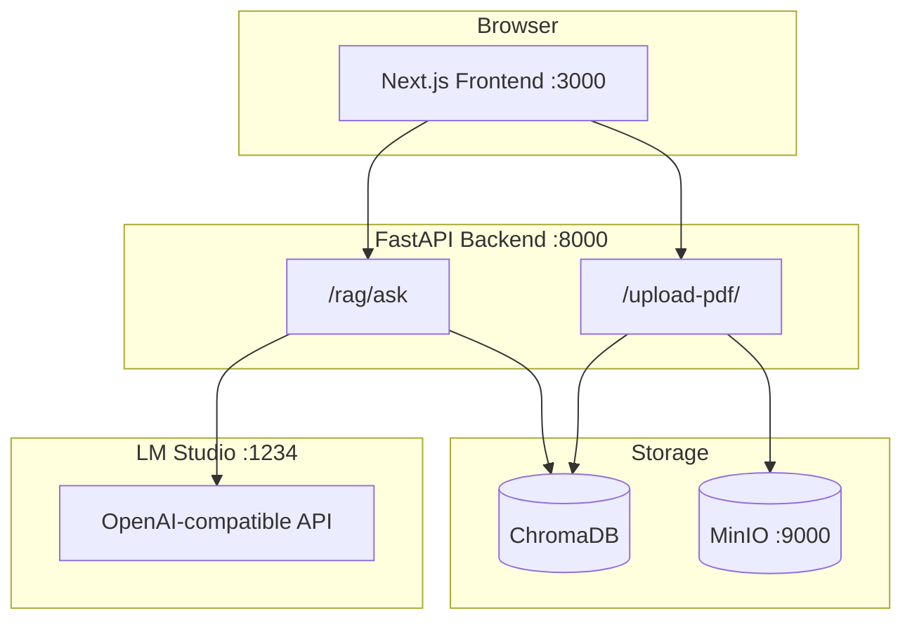

# HFU Anatomy Chatbot — Full Stack Runbook

Complete guide to run **frontend**, **backend**, **MinIO**, and **LM Studio** on Windows (local thesis development).

---

## Architecture



| Service | Port | Role |
|---------|------|------|
| **Frontend** (Next.js) | 3000 | Chat UI, PDF attach |
| **Backend** (FastAPI) | 8000 | RAG, upload, image serving |
| **MinIO** | 9000 / 9001 | PDF figure image storage |
| **LM Studio** | 1234 | Local LLM (`/v1` OpenAI API) |

Optional: **Anatomy MCP** exports labeled 3D models from Z-Anatomy when RAG detects a body part (see §6).

---

## 1. Prerequisites

| Tool | Version | Notes |
|------|---------|--------|
| Python | 3.10 or 3.11 | Not 3.13 for ML pins |
| Node.js | 18+ | For frontend |
| Docker Desktop | latest | For MinIO |
| LM Studio | latest | Load a model, start Local Server |

---

## 2. One-time setup

### 2.1 Clone and venv

```powershell
cd C:\Users\Admin\Downloads\ThesisBackend\ThesisBackend
py -3.11 -m venv .venv311
.\.venv311\Scripts\Activate.ps1
python -m pip install -U pip
python -m pip install -r requirements.txt
```

### 2.2 Environment file

Copy and edit environment variables (create `.env` from `.env.example`):

```powershell
LLM_PROVIDER=lmstudio
LLM_API_BASE=http://127.0.0.1:1234/v1
LLM_API_KEY=lm-studio
LLM_MODEL=google/gemma-4-e2b

STORAGE_PROVIDER=minio
MINIO_ENABLED=true
MINIO_ENDPOINT=localhost:9000
MINIO_ACCESS_KEY=minioadmin
MINIO_SECRET_KEY=minioadmin
MINIO_BUCKET=anatomy-images
```

### 2.3 Frontend dependencies

```powershell
cd frontend
npm install
```

---

## Reset textbook corpus (new PDF only)

Stop the backend first (Chroma locks index files while running), then:

```powershell
cd C:\Users\Admin\Downloads\ThesisBackend\ThesisBackend
.\scripts\clear_rag_corpus.ps1
```

This clears `data/raw`, `data/processed` (Chroma + figures), `data/outputs`, repo `outputs/`, `uploads/`, and objects in the MinIO/Supabase image bucket. **Keeps** `data/hub` (embedding models) and `anatomy_mcp/exports` (3D cache).

Restart the backend and upload your new PDF via the UI.

---

## 3. Start everything (Windows)

### Option A — All-in-one script (recommended)

```powershell
cd C:\Users\Admin\Downloads\ThesisBackend\ThesisBackend
.\scripts\start_full_stack.ps1
```

Opens terminals for **MinIO**, **Backend**, and **Frontend**.

### Option B — Manual steps

**Terminal 1 — MinIO**

```powershell
cd C:\Users\Admin\Downloads\ThesisBackend\ThesisBackend
docker compose --profile minio up -d minio
```

**Terminal 2 — Backend**

```powershell
cd C:\Users\Admin\Downloads\ThesisBackend\ThesisBackend
$env:STORAGE_PROVIDER="minio"
$env:MINIO_ENABLED="true"
.\.venv311\Scripts\python.exe -m uvicorn app.main:app --host 0.0.0.0 --port 8000 --reload
```

**Terminal 3 — Frontend**

```powershell
cd C:\Users\Admin\Downloads\ThesisBackend\ThesisBackend\frontend
npm run dev
```

**LM Studio** — Load model → **Local Server** → port `1234`.

### Open the app

- **UI:** http://127.0.0.1:3000  
- **API docs:** http://127.0.0.1:8000/docs  
- **MinIO console:** http://127.0.0.1:9001 (`minioadmin` / `minioadmin`)

---

## 4. Frontend (Next.js)

### Structure

```
frontend/
  app/
    page.js                 # Main chat page
    layout.js
    globals.css
    components/
      ChatComposer.js       # Paperclip PDF + auto-grow textarea
      ChatMessage.js        # Answers, sources, retrieved images
      SettingsModal.js      # API base URL, health check
      UploadPanel.js        # Knowledge-base PDF upload
```

### Features

- Chat with **Shift+Enter** newline, **Enter** send  
- **Paperclip** — attach PDF from chat (indexes via `/upload-pdf/`)  
- **Resources** (header) — knowledge-base upload modal  
- WhatsApp-green theme, compact header, no sidebar  

### Scripts

```powershell
npm run dev      # Development :3000
npm run build    # Production build
npm run start    # Production server
```

### Configure API URL

Settings (gear icon) → **API Base URL** → default `http://127.0.0.1:8000`

---

## 5. Backend (FastAPI)

### Structure

```
app/
  main.py                   # App entry, CORS, routers
  api/routes/
    rag.py                  # POST /rag/ask
    upload.py               # POST /upload-pdf/
  services/
    rag_service.py
src/
  multimodal/               # RAG chain, hybrid retrieval
  rag/                      # Classifier, rewriter, verifier, prompts
  retrieval/                # Hybrid BM25 + dense
  ingestion/                # PDF chunking
```

### Main API endpoints

| Method | Path | Purpose |
|--------|------|---------|
| POST | `/rag/ask` | Grounded answer + sources + retrieved images |
| POST | `/upload-pdf/` | Index PDF into Chroma + store figures |
| GET | `/images/all` | List extracted figure paths |

### Run backend only

```powershell
.\.venv311\Scripts\python.exe -m uvicorn app.main:app --reload --port 8000
```

---

## 6. RAG pipeline (summary)

1. **Classify** question (`simple`, `complex`, `quote`, `broad`, …)  
2. **Typo correct** + **query rewrite** (2–4 variants)  
3. **Hybrid retrieve** (BM25 + dense + phrase, RRF)  
4. **Rerank** + **citation filter** (drop TOC/footer)  
5. **Prompt** by type (quote mode, figure-first, etc.)  
6. **Verify** answer + **confidence** score  

Eval: `eval/RAG_CHATBOT_TEST_QUESTIONS.md`, `python scripts/run_thesis_batch.py --rubric`

---

## 7. Anatomy MCP (optional 3D export)

Embedded from [anatomy-blender-mcp](https://github.com/AdarshRajDS/anatomy-blender-mcp) in `anatomy_mcp/`.

**Prerequisites:** Blender 5.1, Z-Anatomy `Startup.blend`, label index JSON (included under `anatomy_mcp/label_index/`).

```powershell
# Health
Invoke-RestMethod http://127.0.0.1:8000/anatomy/health

# Manual export
Invoke-RestMethod -Method POST http://127.0.0.1:8000/anatomy/export `
  -ContentType application/json `
  -Body '{"part_query":"liver","include_preview":true}'
```

### Semantic suggestion fallback (optional)

The catalog resolver first tries lexical tiers (exact, token, fuzzy, Latin synonyms). When those are thin, a MiniLM embedding index provides a meaning-based fallback (e.g. "brain stem" → Brainstem). Build it once after `exportable_catalog.json` exists (no Blender needed):

```powershell
$env:HF_HOME="data"
.\.venv311\Scripts\python.exe scripts/build_anatomy_semantic_index.py
```

This writes `anatomy_mcp/label_index/semantic_index.npz` + `semantic_index_meta.json`. If the index or model is missing, the resolver silently falls back to the lexical tiers. Disable with `ANATOMY_SEMANTIC_SUGGEST_ENABLED=false`; tune the cutoff with `ANATOMY_SEMANTIC_MIN_SCORE` (default `0.30`).

When RAG detects an anatomy part, `/rag/ask` includes `anatomy_export` with `viewer_url` (annotation viewer), `model_url` (GLB), and `annotations_url`.

Viewer: `http://127.0.0.1:8000/anatomy-viewer/index.html?model=...&annotations=...`

Set in `.env`: `BLENDER_BIN`, `Z_ANATOMY_BLEND`, `PUBLIC_API_BASE`, `ANATOMY_MCP_ENABLED=true`.

---

## 8. Health checks

```powershell
# Backend
Invoke-RestMethod http://127.0.0.1:8000/
```

---

## 9. Troubleshooting

| Problem | Fix |
|---------|-----|
| `ModuleNotFoundError: rank_bm25` | `pip install rank-bm25` in venv |
| RAG returns empty / errors | LM Studio running on `:1234`, model loaded |
| CORS errors | Backend allows `localhost:3000` by default |
| PDF images broken | Start MinIO; `STORAGE_PROVIDER=minio` |
| Chroma empty | Upload PDF via chat paperclip or Resources |
| Anatomy export fails | Check `/anatomy/health`; verify Blender + Z-Anatomy paths in `.env` |

---

## 10. Production build

```powershell
# Frontend
cd frontend
npm run build
npm run start

# Backend (no reload)
.\.venv311\Scripts\uvicorn app.main:app --host 0.0.0.0 --port 8000
```

Set `ALLOWED_ORIGINS` to your deployed frontend URL.

---

## Quick reference

```text
Frontend:  http://127.0.0.1:3000
Backend:   http://127.0.0.1:8000
MinIO:     http://127.0.0.1:9000
LM Studio: http://127.0.0.1:1234/v1
```

For thesis writing see **THESIS_SOURCEBOOK.md** and **eval/RAG_CHATBOT_TEST_QUESTIONS.md**.
