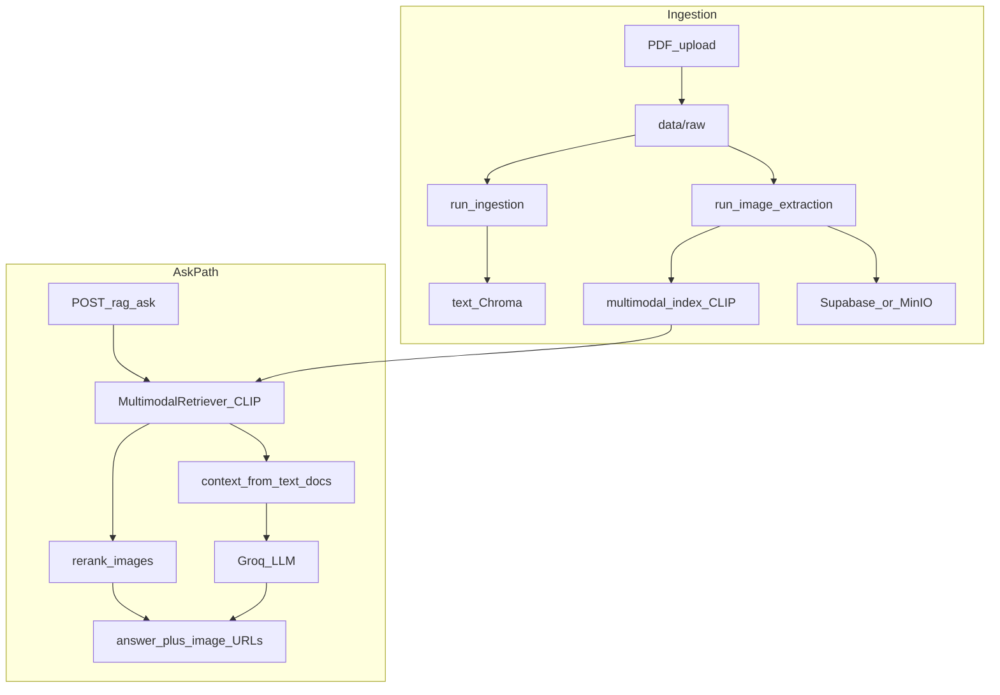
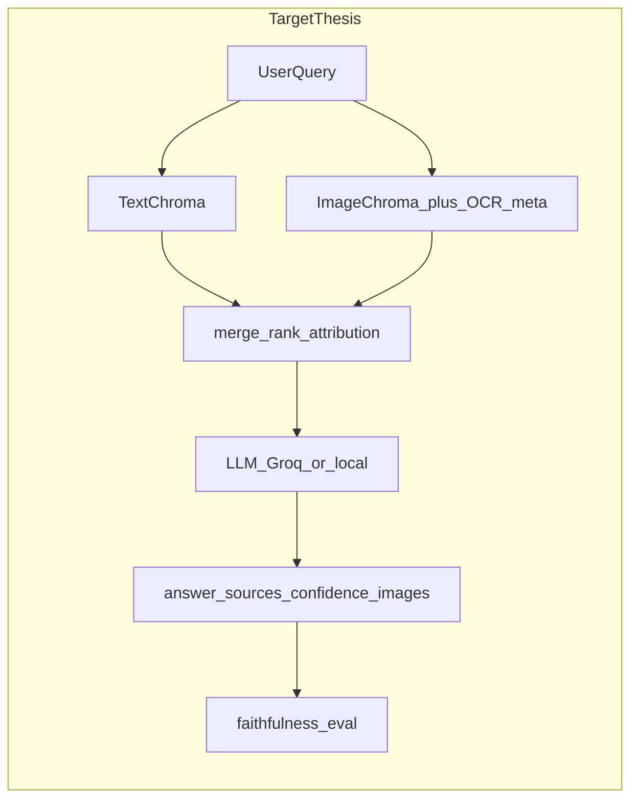

# Thesis roadmap: multimodal anatomy RAG — assessment, workflows, local testing

This document aligns **professor feedback** with the **current ThesisBackend** implementation, defines **target architecture**, and gives a **local verification matrix** (everything except Blender / MCP 3D).

---

## 1. Executive summary

The backend is a **FastAPI** service that ingests PDFs, indexes **text** (sentence-transformers + Chroma) and **images** (CLIP + Chroma), optionally stores images in **Supabase or MinIO**, and answers questions via **Groq** with **0–3** linked images.

**Thesis direction (local-first):**

1. Stabilize ingestion, storage, and `/rag/ask` on your machine.
2. Add **explicit source attribution** and stronger **text–image grounding** (fuse text Chroma into the ask path; optional OCR).
3. Run a **comparative evaluation**: answers with vs without uploaded documents.
4. Add an **evaluation / faithfulness** module and optionally a **local LLM** path.
5. Defer **Blender MCP + pre-made 3D assets** to a separate track (not part of the mandatory local test matrix below).

---

## 2. Current system workflow (as implemented)

High-level data flow from upload to chat:



**Important structural note:** The multimodal Chroma collection is populated with **image** rows (`type: image`). The retriever returns `text_docs` only for non-image rows, so **LLM context is often empty** unless you merge retrieval from the **text** Chroma store. Images still come from CLIP retrieval + reranking. This limits “faithfulness to retrieved prose” until text fusion is implemented.

---

## 3. Target workflow (thesis end-state)



**Response shape (planned):** `answer`, `sources` (chunk ids, page, document name, optional image keys), `confidence` (scalar or coarse label), `images` (0–3 URLs).

---

## 4. Professor feedback checklist

| # | Topic | Current repo status | Planned work | Local dev notes |
|---|--------|----------------------|--------------|-----------------|
| 1 | **With vs without document upload** | No API flag; “no RAG” is procedural (empty `data/raw` / no index). | Add `use_rag: bool` on ask or a `/rag/ask/baseline` route; document gold questions. | Run same questions before/after ingest; log answers side-by-side. |
| 2 | **Source attribution** | [app/schemas/rag.py](app/schemas/rag.py): `answer` + `images` only. | Extend schema with `sources[]`, optional `confidence`. | Validate JSON in frontend; no secrets in responses. |
| 3 | **OCR on images** | Not in [image_extractor.py](src/ingestion/image_extractor.py). | OCR per crop → append to Chroma `documents`/metadata or separate text field for rerank. | Add deps (e.g. easyocr/tesseract); CPU-heavy — test on small PDF first. |
| 4 | **Dynamic 0–3 images** | [multimodal_rag_chain.py](src/multimodal/multimodal_rag_chain.py): thresholds + max 3. | Tighten with OCR relevance + dedup by visual hash or embedding cluster. | Tune thresholds on a fixed question set. |
| 5 | **Blender / 3D** | [app/api/routes/blender.py](app/api/routes/blender.py) exists. | Pre-made assets + MCP: render views, return GLB/preview URLs. | **Out of scope** for mandatory tests below. |
| 6 | **Local LLM** | [llm_factory.py](src/llm/llm_factory.py): Groq. | Optional Ollama/LlamaCpp adapter behind same interface. | Needs RAM/VRAM tradeoffs; document model name + prompt parity. |
| 7 | **Answer quality checker** | [grading](app/api/routes/grading.py) is annotation-focused. | Post-answer judge: faithfulness vs `context`, optional second LLM. | Store scores next to gold set in `eval/` or spreadsheet. |
| 8 | **Overall** | Multimodal path works; text grounding weak without fusion. | **Fuse text retrieval into ask** + attribution + eval. | Follow implementation order in section 9. |

---

## 5. Comparative evaluation protocol (item 1)

**Goal:** Quantify impact of RAG (uploaded anatomy PDFs) vs base model behavior.

### 5.1 Conditions

- **Condition A — Baseline (no corpus):** Empty `data/raw` (or move PDFs aside), clear or ignore `data/processed` Chroma dirs per your experiment design, restart API, ask the same questions. Expect answers from general knowledge (and possibly empty images).
- **Condition B — RAG on:** Ingest one or more PDFs via `POST /upload-pdf/`, wait for pipeline success (`extractor_stats.uploads_ok` if using object storage), then ask the same questions.

### 5.2 Suggested metrics (thesis table)

| Metric | How to approximate locally |
|--------|----------------------------|
| **Answer relevance** | Embedding cosine vs reference answer (sentence-transformers) or LLM-as-judge score. |
| **Faithfulness / grounding** | Compare answer claims to concatenated retrieved text chunks (when text fusion exists); until then, note limitation. |
| **Completeness** | Checklist of required anatomical terms per question. |
| **Source attribution accuracy** | After implementing `sources`, verify cited pages/docs match retrieval logs. |

### 5.3 Gold set

Create **20–30** question–reference pairs, e.g.:

- `eval/gold_questions.json` (or `tests/fixtures/eval/`) with fields: `id`, `question`, `reference_answer`, `required_terms[]`, `expected_doc_hint` (optional).

Run Condition A and B; export answers to CSV for the thesis appendix.

---

## 6. Pytest vs integration testing

| Layer | Command / action | What it proves |
|-------|------------------|----------------|
| **Unit / API mocks** | From repo root: `PYTHONPATH=. pytest tests/test_api.py -q` (use the project `.venv` where dependencies are installed) | Routes and schemas wired; **does not** prove Supabase, Chroma, or Groq. |
| **Integration (local)** | Steps in section 8 | Real PDF, real storage, real embeddings, real LLM key. |

**Thesis recommendation:** Report both: automated smoke tests + one **documented manual integration run** (screenshots or logs).

---

## 7. Local development prerequisites

- **Python:** 3.10+ recommended (matches [Dockerfile](Dockerfile)).
- **Virtualenv:** `python -m venv .venv && source .venv/bin/activate`
- **Dependencies:** `pip install -r requirements.txt`
- **Environment:** copy [.env.example](.env.example) → `.env`
  - `GROQ_API_KEY` — required for `/rag/ask`
  - `HF_HOME=data` — data and Chroma under `data/`
  - **Storage:** `STORAGE_PROVIDER=supabase` or `minio`; `SUPABASE_URL` must match **exact** project URL from Supabase dashboard (typos cause DNS errors).
  - `PUBLIC_BASE_URL=http://127.0.0.1:8000` (or your uvicorn port) if the frontend needs absolute `/outputs` URLs.
- **MinIO (optional):** `docker compose up -d minio` per [README.md](README.md).
- **Supabase:** `pip install supabase` must succeed in the **same** venv as uvicorn.

Start API:

```bash
uvicorn app.main:app --reload --host 0.0.0.0 --port 8000
```

---

## 8. Local verification matrix (Blender excluded)

Execute in order. Treat any step failure as blocking for thesis demos.

| Step | Action | Pass criteria |
|------|--------|----------------|
| 1 | `python -c "import supabase"` (if using Supabase) | No `ImportError` |
| 2 | `GET /` | `200`, `{"status":"running"}` |
| 3 | `GET /debug/storage` | `supabase_import_ok`, `supabase_client_ok` true; `bucket_exists_in_project` true; no DNS errors in `bucket_list_error` |
| 4 | (Optional) Clear `data/raw` and `data/processed` for a clean experiment | Directories empty or documented |
| 5 | `POST /upload-pdf/` with a **small** PDF first | `200`; `pipeline` step 4 `extractor_stats.uploads_ok > 0` when images exist; objects visible in Supabase/MinIO |
| 6 | `POST /rag/ask` with `{"question":"..."}` | Non-empty `answer`; `images` length 0–3; each URL loads in browser |
| 7 | Comparative run (section 5) | Same questions under A vs B; results saved for thesis |
| 8 | `PYTHONPATH=. pytest tests/test_api.py -q` (from repo root, active `.venv`) | All tests pass |

**Excluded:** `/blender/*`, MCP-driven 3D, headless Blender.

---

## 9. Implementation order (for future coding)

1. **Stability:** Supabase upload uses **raw bytes** (not `BytesIO`); `UploadResponse.pipeline` typed as **list of steps** ([app/schemas/upload.py](app/schemas/upload.py)).
2. **Text + image fusion:** Retrieve from text Chroma in `MultimodalRAG.ask` and merge into `context`.
3. **Attribution:** Extend `AskResponse` with `sources` (+ optional `confidence`).
4. **OCR:** Add text from images into metadata / index for better retrieval.
5. **Evaluation module:** Gold set + automated scores (item 7).
6. **Local LLM:** Optional backend in `llm_factory`.
7. **Blender MCP:** Pre-made assets, rendering only (separate milestone).

---

## 10. Troubleshooting (from recent debugging)

| Symptom | Likely cause | Fix |
|---------|----------------|-----|
| `SUPABASE UPLOAD ERROR: ... not BytesIO` / bytes vs file | Supabase Python client expects **`bytes`** for `upload` body | Pass `data` directly in [object_storage.py](app/services/object_storage.py) |
| `POST /upload-pdf/` **500** + `pipeline` validation error | Response model expected `dict` but server returns **list** of steps | `pipeline: Optional[List[Dict[str, Any]]]` in [UploadResponse](app/schemas/upload.py) |
| `nodename nor servname provided` in storage debug | Wrong `SUPABASE_URL` host (typo in project ref) | Copy **Project URL** exactly from Supabase → Settings → API |
| `No module named 'supabase'` | Package not installed in venv running uvicorn | `pip install supabase` in active `.venv` |
| Images empty in UI but API returns `/outputs/...` | Relative URLs | Set `PUBLIC_BASE_URL` to full backend origin |

---

## 11. Appendix: Blender / MCP (future)

- Use **curated anatomical GLB/BLEND** assets.
- **MCP** exposes tools: load asset, set camera, render PNG, export GLB.
- Backend returns **preview URL + asset URL**; no in-repo training of generative 3D.

This appendix is **not** part of the mandatory local matrix in section 8.

---

## 12. Repository map (quick reference)

| Area | Path |
|------|------|
| FastAPI entry | [app/main.py](app/main.py) |
| RAG API | [app/api/routes/rag.py](app/api/routes/rag.py) |
| Upload | [app/api/routes/upload.py](app/api/routes/upload.py) |
| Storage debug | [app/api/routes/debug_storage.py](app/api/routes/debug_storage.py) |
| Ingestion orchestration | [app/services/ingestion_service.py](app/services/ingestion_service.py) |
| Object storage | [app/services/object_storage.py](app/services/object_storage.py) |
| Multimodal chain | [src/multimodal/multimodal_rag_chain.py](src/multimodal/multimodal_rag_chain.py) |
| Text ingestion | [src/ingestion/run.py](src/ingestion/run.py) |
| Image extraction | [src/ingestion/image_extractor.py](src/ingestion/image_extractor.py) |
| API tests | [tests/test_api.py](tests/test_api.py) |

---

*Document version: aligned with ThesisBackend multimodal RAG thesis scope; local testing excludes Blender/MCP until that milestone is scheduled.*
