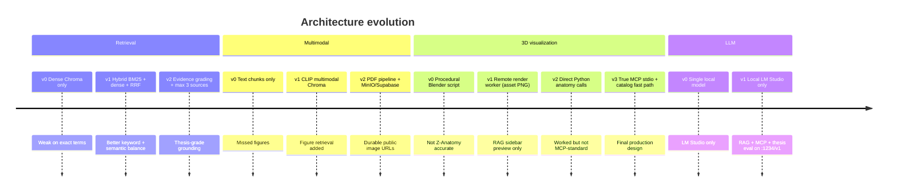
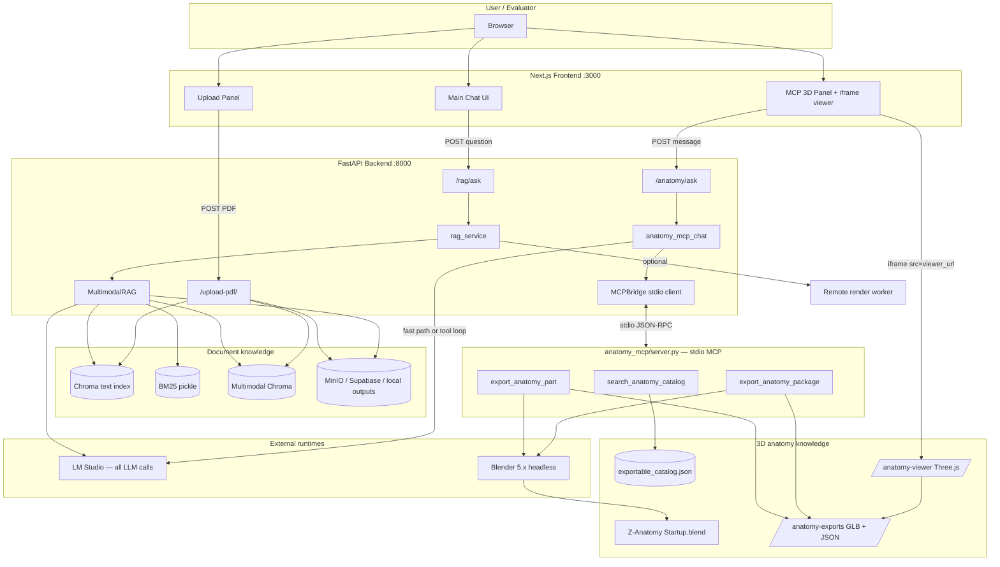
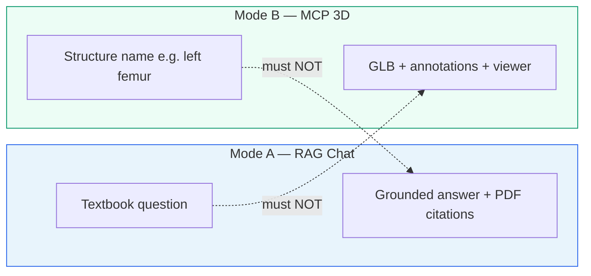
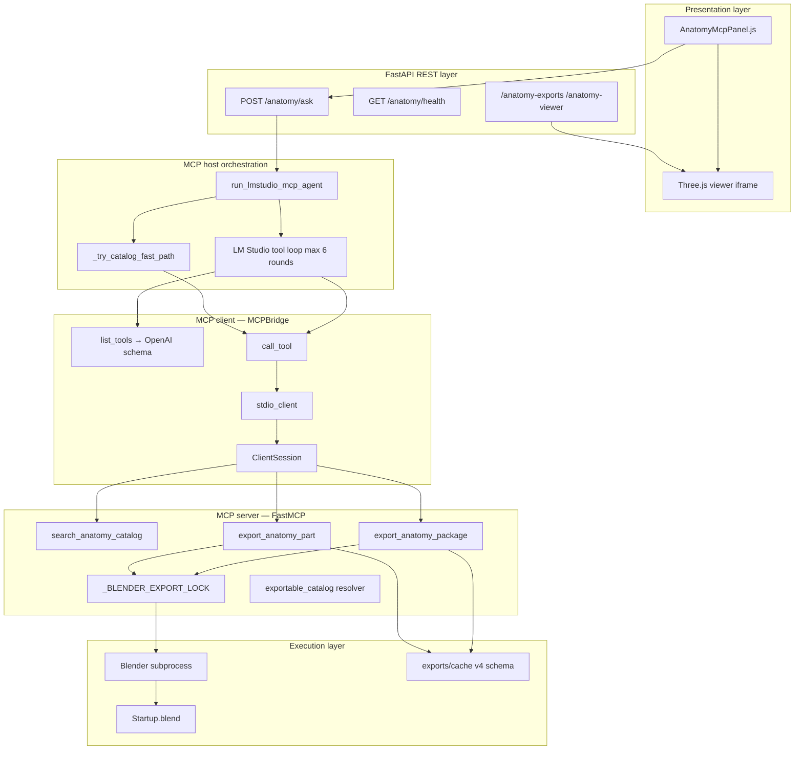
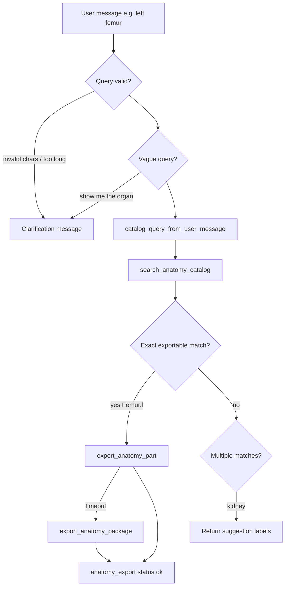
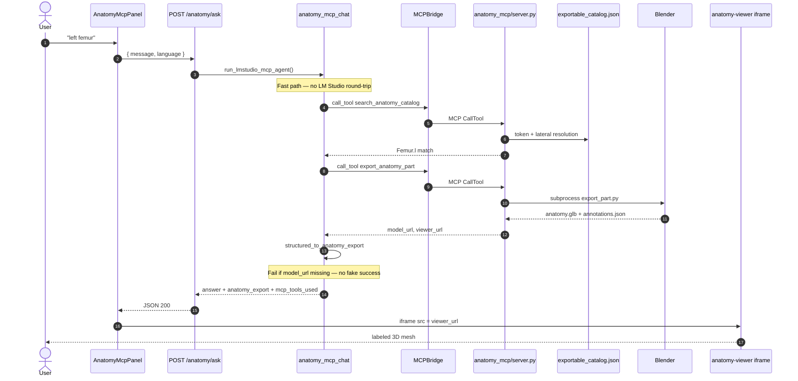
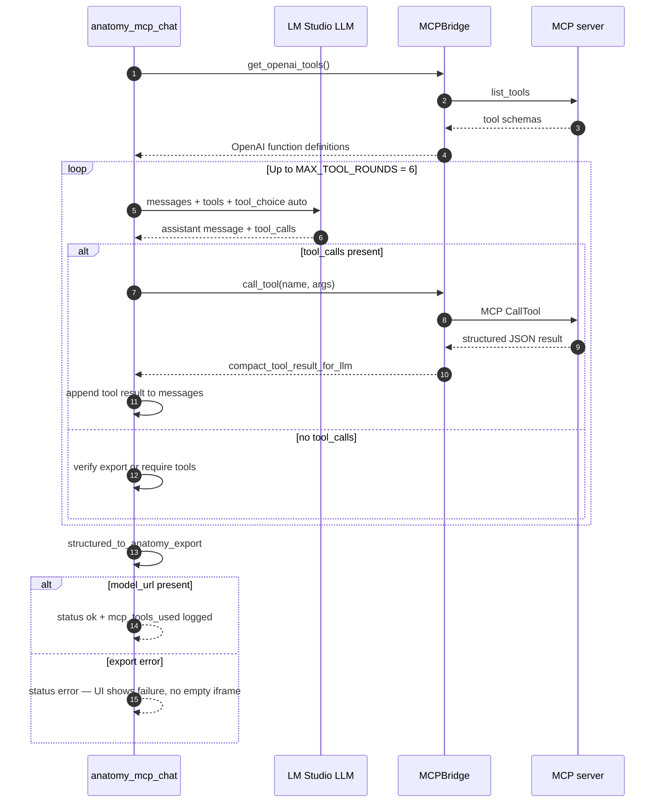
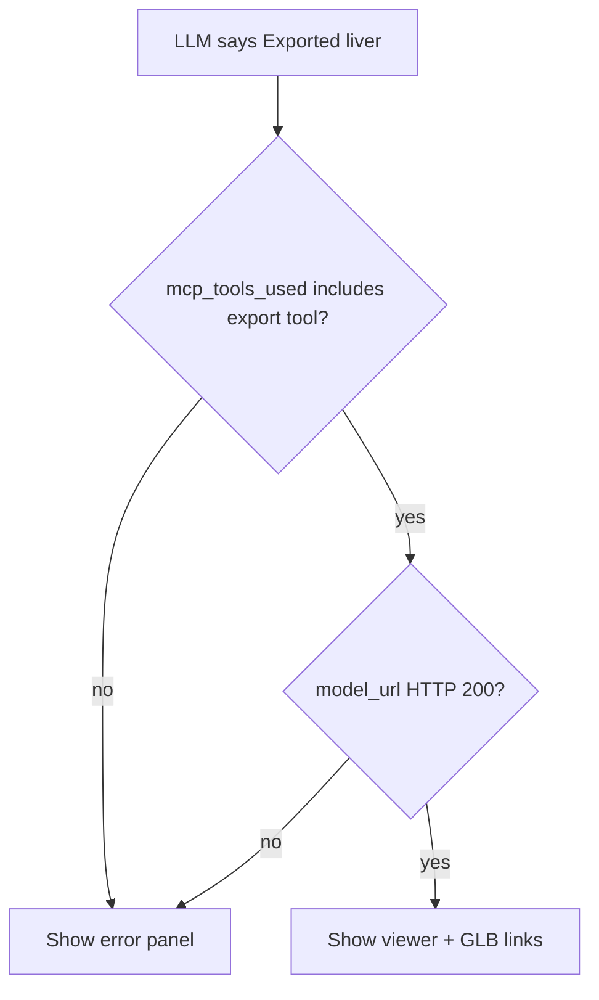
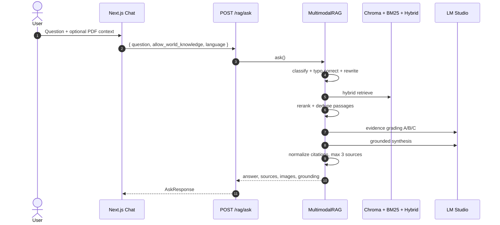

# HFU Multimodal Anatomy Chatbot — System Design, Evolution, and MCP Architecture

**Document type:** Thesis technical design record  
**Scope:** Planning rationale, failed/iterative approaches, final architecture, and Model Context Protocol (MCP) integration  
**Repository:** `ThesisBackend` (FastAPI + Next.js + `anatomy_mcp/`)

---

## 1. Executive summary

This project delivers a **multimodal anatomy learning assistant** with two deliberately separated capabilities:

| Mode | User intent | Knowledge source | Output |
|------|-------------|------------------|--------|
| **RAG Chatbot** | Answer textbook questions from uploaded PDFs | Chroma + BM25 + optional CLIP figure index | Grounded text, ≤3 citations, optional figures |
| **MCP 3D Anatomy** | Export and inspect a named body structure | Z-Anatomy `Startup.blend` + geometry-proven catalog | GLB + annotation JSON + Three.js viewer |

The thesis contribution is not “one model that does everything,” but a **dual-pipeline architecture** where document grounding and 3D geometry export remain **evaluated independently**. The final 3D path implements the **official Model Context Protocol** (`stdio` transport, `ClientSession.call_tool`, FastMCP tool server) rather than ad-hoc Python function calls or prompt-only LLM hallucination.

---

## 2. Original research goals

When the project started, the goals were:

1. **Grounded Q&A** — Students ask anatomy questions; answers must cite uploaded course PDFs, not unconstrained LLM knowledge.
2. **Multimodal support** — Textbook figures (diagrams, histology, radiology stills) should appear when relevant, not only text chunks.
3. **3D visualization** — When a structure is named, the system should produce inspectable 3D geometry with labels, not a static screenshot alone.
4. **Reproducible evaluation** — RAG quality (citation accuracy, abstention) and 3D export success (GLB URL, viewer load) must be measurable separately.
5. **Local-first deployment** — Run on a Windows developer machine: LM Studio, Blender 5.x, Z-Anatomy, optional MinIO.

These goals drove every architectural decision below.

---

## 3. Initial approach (v0) and its flaws

### 3.1 What we built first

The first iteration was a **monolithic FastAPI + single LLM** stack:

```
User question → Chroma similarity search → top-k chunks → LLM prompt → answer
```

Supporting pieces:

- PDF upload → text chunking → MiniLM embeddings → Chroma persist directory
- Optional local `/outputs` folder for extracted images
- A separate experimental path: **prompt Blender to procedurally generate geometry** (`src/mcp/blender_generator.py`, `BlenderMCP.generate_3d_brain`)

### 3.2 Flaws discovered in practice

| Flaw | Symptom | Root cause |
|------|---------|------------|
| **Weak retrieval** | Correct answer in PDF but wrong passage retrieved | Dense-only search; no BM25 for exact terms (e.g. “mitral valve”, “NMJ”) |
| **Citation sprawl** | 10+ reference cards; duplicates from same page | No deduplication, no max-source cap, no evidence grading |
| **Ungrounded synthesis** | Plausible anatomy not in corpus | LLM answered from parametric knowledge when retrieval was empty |
| **Figure blindness** | Questions about labeled diagrams missed images | Text-only index; figures stored but not retrieved cross-modally |
| **Fragile image URLs** | Broken images after restart or HF deploy | Local paths only; no object storage abstraction |
| **Fake 3D success** | UI showed “Exported liver” with no GLB | LLM text claimed export; no tool verification |
| **Wrong 3D source** | Procedural “brain” mesh unrelated to Z-Anatomy | `blender_generator.py` creates synthetic geometry, not curriculum-accurate labels |
| **Name-only matching** | “kidney” export failed or picked wrong collection | Raw label index lists scene names, not exportable geometry |
| **Parallel Blender corruption** | Random export failures on Windows | Multiple Blender subprocesses writing concurrently |
| **Coupled evaluation** | Could not tell if RAG or 3D failed | Single chat endpoint mixed document answers and export URLs |

These flaws motivated the phased redesign documented in Sections 4–7.

---

## 4. Approaches we tried (chronological evolution)

### 4.1 Overview timeline



---

### 4.2 Approach A — Dense vector RAG only

**Design:** `VectorStoreFactory` + `similarity_search(k=...)`.

**Why we tried it:** Fastest path to a demo; LangChain/Chroma defaults.

**Result:** Failed on anatomy terminology where embedding similarity diverges from exact nomenclature (Latin names, hyphenation, “left vs right”).

**Replacement:** `HybridRetriever` in `src/retrieval/hybrid_retriever.py` — BM25 + dense + phrase matching fused with **Reciprocal Rank Fusion (RRF)**.

---

### 4.3 Approach B — Multimodal RAG (CLIP + text)

**Design:** `MultimodalRAG` combines:

- Text corpus (MiniLM Chroma, same as ingestion)
- Multimodal retriever (`MultimodalRetriever` + `CLIPEmbedding`)
- Up to 3 unique text passages (`_MAX_UNIQUE_TEXT_PASSAGES = 3`)

**Why we tried it:** Anatomy learning is inherently visual; students ask about figures explicitly.

**Improvements over A:**

- Retrieves figure metadata and serves images from `/outputs` or presigned storage
- Dedupes by PDF stem + page + text fingerprint

**Remaining gap:** Still no 3D export; images are 2D textbook figures only.

---

### 4.4 Approach C — Strict grounding & thesis evaluation pipeline

**Design:** `src/multimodal/thesis_rag_eval.py` — parallel experiment track:

- **Baseline** — LLM without retrieval (measures hallucination rate)
- **Strict RAG** — answer only from numbered passages
- **Coherent synthesis** — stricter prompt with citation IDs
- **Blind judge** — compares baseline vs strict

**Why we tried it:** Quantify *how much* retrieval helps for thesis evaluation (`POST /rag/experiment/ask`).

**Lesson:** Production `POST /rag/ask` and experiment pipeline stay separate so tuning does not break live UI.

---

### 4.5 Approach D — Procedural Blender generation (`BlenderMCP`)

**Design:** `src/mcp/blender_mcp.py` + `blender_generator.py`

```
LLM prompt → blender --background --python blender_generator.py → synthetic GLB
```

**Why we tried it:** Quick 3D “something” without licensing a full anatomy asset library.

**Flaws:**

- Geometry is **not** Z-Anatomy; labels do not match course material
- No annotation JSON sidecar
- `POST /blender/generate-brain-3d` is a research stub, not curriculum export

**Status:** Kept for optional brain demo; **not** the MCP catalog path.

---

### 4.6 Approach E — Remote Blender render worker (RAG adjunct)

**Design:** `app/services/blender_service.py` → `render_related_anatomy()`

```
POST /rag/ask → detect keyword (brain, heart, spine…) → POST {BLENDER_SERVER_URL}/render-asset → PNG URL
```

**Why we tried it:** Attach a **related 3D preview** to RAG answers without blocking on full GLB export latency.

**Characteristics:**

- Fixed asset map (`ASSET_MAPPING`: brain, heart, hand, lung, spine)
- Worker uploads to object storage; backend stores **no local render files**
- Returns `render_3d_url` in RAG response (optional, best-effort)

**Flaws:**

- Only ~5 pre-authored assets; no arbitrary “left femur” from user query
- Docker `blender` service in `docker-compose.yml` is a **different** worker from Z-Anatomy MCP export
- Must not be confused with MCP panel exports in evaluation

**Status:** Optional RAG enhancement; orthogonal to MCP.

---

### 4.7 Approach F — Label index without exportable catalog

**Design:** Scan Z-Anatomy once → `z_anatomy_index.json` (all collection/object names in scene).

**Why we tried it:** First automated bridge from natural language to Blender object names.

**Flaws:**

- Index proves **name exists**, not that mesh is exportable
- Broad queries (`kidney`, `iris`) hit ambiguous or empty collections
- Exports sometimes succeeded with **huge** selections (entire limb regions)

**Replacement:** `build_exportable_catalog.py` → `exportable_catalog.json` — entries validated by geometry probe in Blender.

---

### 4.8 Approach G — Direct in-process Python calls (pre-MCP)

**Design:** Import `anatomy_mcp/server.py` functions directly from FastAPI handlers.

**Why we tried it:** Fastest integration before MCP SDK maturity on Windows.

**Flaws:**

- Not interoperable with LM Studio, Claude Desktop, or MCP Inspector
- No standard tool discovery / schema contract
- LLM could not participate in multi-step tool loops using a portable protocol
- Harder to sandbox Blender side effects

**Replacement:** True MCP stdio server + `MCPBridge` client (Approach H).

---

### 4.9 Approach H — True MCP with dual execution paths (FINAL)

**Design:** See Section 6–7. This is the production 3D architecture.

---

### 4.10 Storage approaches tried

| Approach | Mechanism | When used | Flaw / fix |
|----------|-----------|-----------|------------|
| Local `outputs/` | FastAPI static mount | Earliest dev | URLs break on multi-replica / HF Spaces |
| MinIO | S3-compatible Docker (`docker-compose.yml`) | Local full stack | Requires Docker; good for dev |
| Supabase Storage | `STORAGE_PROVIDER=supabase` | Production / HF | Needs service role key; auto-selected when env set |

Image pipeline steps are observable via `GET /debug/storage` and upload response `pipeline` array.

---

### 4.11 LLM provider approaches

| Role | Initial | Final |
|------|---------|-------|
| RAG synthesis | LM Studio local | **LM Studio** OpenAI-compatible API at `:1234/v1` |
| MCP tool host | N/A | **LM Studio** (same server and model config) |
| Evidence grading / judge | LM Studio | LM Studio (thesis eval) |

**Rationale:** Local-first thesis deployment — no cloud LLM keys; one OpenAI-compatible endpoint for RAG synthesis, evidence grading, MCP tool loops, and blind judge experiments.

---

## 5. Final architecture (what we reached)

### 5.1 System context



### 5.2 Separation of concerns (evaluation rule)



**Thesis rule:** Never score a RAG answer on GLB export success; never score an MCP export on PDF citation quality.

---

## 6. MCP deep dive — protocol, components, and guarantees

### 6.1 What “proper MCP” means in this project

The implementation satisfies the MCP contract at three layers:

| Layer | Component | Responsibility |
|-------|-----------|----------------|
| **Tool server** | `anatomy_mcp/server.py` | FastMCP registers tools; runs Blender; returns structured JSON |
| **Transport** | `stdio` via `mcp.client.stdio` | Parent process spawns server; no HTTP port on MCP server |
| **Host orchestration** | `app/services/anatomy_mcp_chat.py` | LM Studio chooses tools; backend executes via `ClientSession.call_tool` |

**Non-MCP patterns explicitly rejected:**

- LLM printing `http://.../anatomy.glb` without calling a tool
- Direct Python import of export functions from FastAPI routes
- Hard-coded export in frontend

### 6.2 MCP layer diagram



### 6.3 MCP tool catalog

| Tool | Input | Output | When used |
|------|-------|--------|-----------|
| `search_anatomy_catalog` | `query`, `limit` | Ranked catalog entries, suggestions, ambiguity errors | Every export path starts here or equivalent resolution |
| `export_anatomy_part` | `part_query`, `include_preview` | `model_url`, `annotations_url`, `viewer_url`, metadata | Single structure (e.g. `Femur.l`, `Liver`) |
| `export_anatomy_package` | `part_query`, options | Study package with subparts for large regions | Brain, thalamus; fallback after part export timeout |

**Safety boundaries** (from `anatomy_mcp/README.md`):

- No arbitrary `.blend` paths from user input
- No arbitrary Python injection
- No full-scene export by default
- Serialized Blender lock — one export at a time on Windows

### 6.4 Catalog resolution pipeline



**Key data artifact:** `exportable_catalog.json` — only entries with proven mesh geometry. This replaced naive `z_anatomy_index.json` matching.

### 6.5 MCP sequence — fast path (plain queries)

Used when input matches `looks_like_plain_anatomy_query` (≤80 chars, alphanumeric + space/dot/dash).



**Why fast path exists:** Blender exports take 30–120s. Skipping LLM orchestration for `"Femur.l"`-style queries reduces failure modes and token cost.

### 6.6 MCP sequence — LLM tool loop (complex queries)



**Host prompt constraints** (`build_mcp_system_prompt` in `app/i18n/locale.py`):

- Must call `export_anatomy_part` or `export_anatomy_package` before claiming success
- Must not echo raw package manifest URLs to user
- Must ask clarification on vague queries
- Retry package export after part export timeout

### 6.7 How the final approach **ensures** MCP integrity

| Guarantee | Mechanism | Code reference |
|-----------|-----------|----------------|
| **Real tool discovery** | `session.list_tools()` → OpenAI schemas | `MCPBridge.get_openai_tools()` |
| **Real tool execution** | `session.call_tool(name, arguments)` | `MCPBridge.call_tool()` |
| **Stdio isolation** | Separate Python process for `server.py` | `StdioServerParameters` |
| **Structured tool results** | `structuredContent` + text fallback parsing | `extract_structured_from_tool_payload()` |
| **No hallucinated exports** | `structured_to_anatomy_export` returns `null` without `model_url` | `anatomy_mcp_client.py` |
| **UI honesty** | Frontend checks `anatomy_export.status === "ok"` before iframe | `AnatomyMcpPanel.js` |
| **Audit trail** | Response includes `mcp_tools_used`, `mcp_tool_steps` | `_agent_result()` |
| **URL rewriting** | Dev server `:8123` → public API base | `rewrite_local_urls()` |
| **Concurrency safety** | `threading.RLock` around Blender | `anatomy_mcp/server.py` |
| **Health probe** | `GET /anatomy/health` checks Blender, catalog, MCP import | `anatomy_mcp_health()` |



---

## 7. Final approach — what we implemented in the last iteration

### 7.1 Backend wiring (`app/main.py`)

Routers and static mounts required for MCP UI:

- `app.include_router(anatomy_mcp.router)` → `/anatomy/*`
- `app.mount("/anatomy-exports", ...)` → GLB, packages, annotations
- `app.mount("/anatomy-viewer", ...)` → Three.js viewer assets

### 7.2 Settings contract (`src/config/settings.py`)

Environment-driven configuration for MCP:

- `PUBLIC_API_BASE` — URL prefix for exported assets
- `BLENDER_BIN`, `Z_ANATOMY_BLEND` — passed into MCP server env
- `LLM_API_BASE` — LM Studio for tool host
- `ANATOMY_MCP_ENABLED` — feature gate

### 7.3 Frontend MCP panel

`frontend/app/components/AnatomyMcpPanel.js`:

- Calls `POST /anatomy/ask` (not `/rag/ask`)
- Renders `AnatomyExportPanel` with viewer link, GLB download
- Salvage path parses URLs from verbose LLM dumps (legacy compatibility)
- i18n EN/DE strings for errors including “restart backend if 404”

### 7.4 Caching & performance

- Export cache schema **v4** under `anatomy_mcp/exports/cache/`
- Repeated `Femur.l` queries hit cache → near-instant URLs
- Package exports for large structures avoid timeout on single-part mesh

### 7.5 RAG path (unchanged responsibility)

`POST /rag/ask` still uses `MultimodalRAG` + optional `render_3d_url` from remote worker — **does not** invoke MCP tools by default. This preserves evaluation separation.

---

## 8. RAG pipeline reference (Mode A detail)



---

## 9. Comparison matrix (for thesis discussion section)

| Dimension | Initial v0 | Final system |
|-----------|------------|--------------|
| Retrieval | Dense only | Hybrid BM25 + dense + RRF + phrases |
| Grounding | Prompt-only | Evidence grading + abstention + max 3 sources |
| Figures | Ignored | CLIP multimodal index + storage URLs |
| 3D source | Procedural script | Z-Anatomy catalog + Blender export |
| 3D protocol | Direct Python / fake LLM text | MCP stdio + tool audit trail |
| LLM | Single local | LM Studio only (RAG + MCP + eval) |
| Storage | Local folder | MinIO / Supabase abstraction |
| Evaluation | Mixed | Separated RAG vs MCP metrics |
| Export correctness | Name in index | Geometry-proven catalog |
| Parallelism | Unsafe | Blender export lock |

---

## 10. Known limitations & future work

1. **LM Studio dependency for complex MCP queries** — Fast path avoids it; natural-language disambiguation still needs tool-capable local model.
2. **Windows-only Blender path** — Linux/Mac require different Blender binary paths.
3. **Export latency** — Large packages (brain) may exceed user patience; cache mitigates repeat queries.
4. **RAG render worker** — Only five asset keys; not a general anatomy renderer.
5. **MCP + RAG fusion** — Deliberately not merged; future work could *link* citation text to MCP viewer via shared entity IDs without mixing retrieval corpora.

---

## 11. Verification checklist

### RAG (Mode A)

```powershell
curl -X POST http://127.0.0.1:8000/rag/ask `
  -H "Content-Type: application/json" `
  -d '{"question":"What is the function of the mitral valve?","allow_world_knowledge":false,"language":"en"}'
```

Pass: answer cites PDF sources; no GLB URLs.

### MCP (Mode B)

```powershell
curl -X POST http://127.0.0.1:8000/anatomy/ask `
  -H "Content-Type: application/json" `
  -d '{"message":"left femur","language":"en"}'
```

Pass: `anatomy_export.status == "ok"`, `mcp_tools_used` includes `export_anatomy_part`, viewer URL loads.

### MCP health

```powershell
Invoke-RestMethod http://127.0.0.1:8000/anatomy/health
```

Pass: `ready: true`, `mcp_stdio_ok: true`, `blender_exists: true`, `exportable_catalog_exists: true`.

---

## 12. Key file index

| Path | Role |
|------|------|
| `app/main.py` | FastAPI entry, routers, static mounts |
| `app/services/rag_service.py` | RAG + optional render worker |
| `app/services/anatomy_mcp_chat.py` | MCP host agent (fast path + tool loop) |
| `app/services/anatomy_mcp_client.py` | MCPBridge stdio client |
| `app/services/anatomy_mcp_service.py` | Health checks, env configuration |
| `anatomy_mcp/server.py` | FastMCP tool server |
| `anatomy_mcp/label_index/exportable_catalog.json` | Geometry-validated catalog |
| `anatomy_mcp/viewer/` | Three.js annotation viewer |
| `src/multimodal/multimodal_rag_chain.py` | MultimodalRAG core |
| `src/retrieval/hybrid_retriever.py` | BM25 + dense hybrid |
| `frontend/app/components/AnatomyMcpPanel.js` | MCP UI |
| `docs/ARCHITECTURE_FOR_DIAGRAMS.md` | Diagram source pack |

---

## 13. Conclusion

The project evolved from a **single-path RAG demo** into a **dual-mode architecture** grounded in evaluation needs:

- **Documents** are handled by retrieval-augmented generation with strict citation limits.
- **Geometry** is handled by a **standards-based MCP toolchain** connecting an LLM host, a stdio tool server, Blender, and a web viewer.

The final MCP design is not “MCP-themed naming” — it implements discoverable tools, stdio transport, structured tool results, and verifiable export URLs. The **fast path** optimizes common classroom queries without bypassing MCP (`call_tool` is still used); the **LLM tool loop** handles ambiguous natural language while respecting the same server contract.

This document should be cited alongside `docs/ARCHITECTURE_FOR_DIAGRAMS.md` when generating thesis figures: use **blue** styling for RAG paths and **green** styling for MCP paths in all diagrams.

---

*Generated from repository state and architecture records. Update when new approaches are tried or MCP tools change.*
